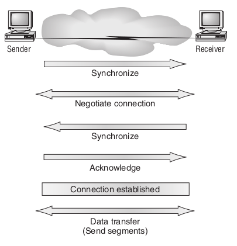
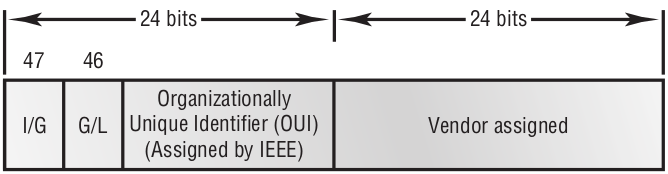

# Cisco Certified Network Associate Study Guide (Exam 640-820) 6th Edition

# Chapter 1: Internetworking

The main purpose of a switch is to make a LAN work better—to optimize its performance—providing more
bandwidth for the LAN’s users.

> Note: Switches create separate collision domains but a single broadcast domain.
> Routers provide a separate broadcast domain for each interface.

## The OSI Reference Model

| Layer | Name         | Functions                                                                                                                                                    | Group       |
|-------|--------------|--------------------------------------------------------------------------------------------------------------------------------------------------------------|-------------|
| 7     | Application  | Provides a user interface. <br/>File, print, message, database and application services.                                                                     | Upper Layer |
| 6     | Presentation | Presents data. <br/>Handles processing such as encryption, compression, and translation services.                                                            | Upper Layer |
| 5     | Session      | Keeps different application’s data separate. <br/>Dialog control.                                                                                            | Upper Layer |
| 4     | Transport    | Provides reliable or unreliable delivery. <br>Performs error correction before retransmit. <br/>End-to-end connection.                                       | Lower Layer |
| 3     | Network      | Provides logical addressing, which routers use for path determination. <br/>Routing.                                                                         | Lower Layer |
| 2     | Data Link    | Combines packets into bytes and bytes into frames. <br>Provides access to media using MAC address<br> Performs error detection not correction. <br/>Framing. | Lower Layer |
| 1     | Physical     | Moves bits between devices. <br>Specifies voltage, wire speed, and pin-out of cables. <br/> Physical topology                                                | Lower Layer |

### The Transport Layer

The Transport layer can be connectionless or connection-oriented. However, Cisco is mostly concerned with you understanding the connection-oriented portion of the Transport layer.

#### Flow Control

Flow control prevents a sending host on one side of the connection from overflowing the buffers in the receiving host—an event that can result in lost data

- The segments delivered are acknowledged back to the sender upon their reception.
- Any segments not acknowledged are retransmitted.
- Segments are sequenced back into their proper order upon arrival at their destination.
- A manageable data flow is maintained in order to avoid congestion, overloading, and data loss.

#### Connection-Oriented Communication

Connection-Oriented Communication **Three-Way Handshake**

- The first “connection agreement” segment is a request for synchronization. **SYN**
- The second and third segments acknowledge the request and establish connection sequencing is synchronized here as well so that a bidirectional connection is formed. **SYN-ACK**
- The final segment is also an acknowledgment. It notifies the destination host that the connection agreement has been accepted and that the actual connection has been established. **ACK**

Data transfer can now begin.



### The Network Layer (Layer 3, Routing)

**Some points about routers**

- By default, will not forward any broadcast or multicast packets.
- Use the logical address in a Network layer header to determine the next hop router to forward the packet to.
- Can use access lists, created by an administrator, to control security on the types of packets that are allowed to enter or exit an interface.
- Can provide layer 2 bridging functions if needed and can simultaneously route through the same interface.
- Provide connections between virtual LANs (VLANs).
- Can provide quality of service (QoS) for specific types of network traffic.

(Also called layer 3) manages device addressing, tracks the location of devices
on the network, and determines the best way to move data.

It happens like this:

* When a packet is received on a router interface, the destination IP
  address is checked
    * If the packet isn’t destined for that particular router, it will look up the destination network address in the routing table.
    * If the router can’t find an entry for the packet’s destination network in the routing table, the router drops the packet

Two types of packets are used at the Network layer:

* **Data packets:** Used to transport user data through the internetwork. (IP and IPv6)
    * Protocols used to support data traffic are called routed protocols
* **Route update packets:** Used to update neighboring routers about the networks connected to all routers within the internetwork. (RIP, RIPv2, EIGRP, and OSPF)
    * Help build and maintain routing tables on each router.

The routing table used in a router includes the following information:

- Network addresses
- Interface
- Metric

### The Data Link Layer (Layer 2, Framing)

* Provides the physical transmission of the data and handles error notification, network topology, and flow control.
* Responsible for the actual unique identification of each device that resides on a local network

**Data Link layer has two sublayers:**

- **Media Access Control (MAC) 802.3**
    - Physical addressing is defined here
- **Logical Link Control (LLC) 802.2**
    - Responsible for identifying Network layer protocols and then encapsulating them.

### Switches and Bridges at the Data Link Layer

* Primarily, **layer 3** machines (such as **routers**) need to **locate specific networks**, whereas **layer 2** machines (**switches and bridges**) need to eventually **locate specific devices**.
* Networks are to routers as individual devices are to switches and bridges.
* Routing tables that “map” the internetwork are for routers as filter tables that “map” individual devices are for switches and bridges.

> Note: Latency is the time measured from when a frame enters a port to the time it exits a port.

When a switch interface receives a frame with a destination hardware address that isn’t found in the device’s filter table, it will forward the frame to all connected segments.
If the unknown device that was sent the “mystery frame” replies to this forwarding action, the switch updates its filter table regarding that device’s location.

### The Physical Layer

* It sends bits and receives bits
* Is also where you identify the interface between the _data terminal equipment_ (**DTE**) and the _data communication equipment_ (**DCE**).
* The **DCE** is usually located at the service provider, while the **DTE** is the attached device.

## Ethernet Networking

### Half- and Full-Duplex Ethernet

Full-duplex Ethernet can be used in three situations:

1. With a connection from a switch to a host
2. With a connection from a switch to a switch
3. With a connection from a host to a host using a crossover cable

> Note: Full-duplex Ethernet requires a point-to-point connection when only two nodes are present. You can run full-duplex with just about any device except a hub.

> Note: Half-duplex Ethernet shares a collision domain and provides a lower effective throughput than full-duplex Ethernet, which typically has a private collision domain and a higher effective
> throughput.

### Ethernet at the Data Link Layer

#### Ethernet Addressing

* Uses the Media Access Control (MAC) address burned into each and every Ethernet network interface card (NIC)
* The MAC, or hardware, address is a 48-bit (6-byte) address written in a hexadecimal format.



Look closely at the figure. The high-order bit is the **Individual/ Group (I/G)** bit:

- **0**, we can assume that the address is the MAC address of a device and may well appear in the source portion of the MAC header
- **1**, We can assume that the address represents either a broadcast or multicast address in Ethernet

The next bit is the **Global/Local (G/L) or Universal/Local (U/l)** bit:

- **0**, this bit represents a globally administered address (as by the IEEE)
- **1**, this bit represents a locally administered address (as in what DECnet used to do)

#### Ethernet Frames

The Data Link layer is responsible for combining bits into bytes and bytes into frames.

```angular2html
Destination: 00:60:f5:00:1f:27
Source: 00:60:f5:00:1f:2c
Protocol Type: 08-00 IP
```

- Type field has **0x86dd** when we are carrying **IPv6** data
- We use **0x0800** in the protocol field when we have **IPv4** data

## Ethernet Cabling

Three types of Ethernet cables are available:

1. **Straight-through cable:**
    - Host to switch or hub
    - Router to switch or hub
    - Connect 1 to 1, 2 to 2, 3 to 3, and 6 to 6
2. **Crossover cable:**
    - Host to host
    - Switch to switch
    - Hub to hub
    - Hub to switch
    - Router to host
    - Connect pins 1 to 3 and 2 to 6 on each side of the cable.
3. **Rollover cable:**
    - Host to the console port
    - Eight wires are used in this cable to connect serial devices

## Data Encapsulation


**At a transmitting device, the data encapsulation method works like this:**

1. **User information is converted to data** for transmission on the network.
2. **Data is converted to segments** and a reliable connection is set up between the transmitting and receiving hosts.
3. **Segments are converted to packets or datagrams**, and a logical address is placed in the header so each packet can be routed through an internetwork.
4. **Packets or datagrams are converted to frames** for transmission on the local network.
5. **Frames are converted to bits**, and a digital encoding and clocking scheme is used.

