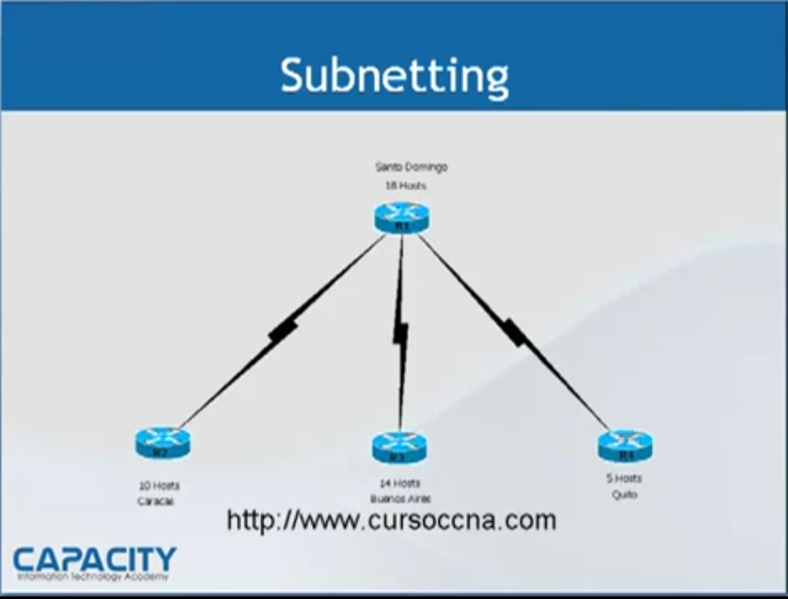

# CCNA

# Componentes Importantes

1. IOS
    - Sistema Operativo de los Routers y Switches Cisco.
2. NVRAM
    - Non-Volatile Random Access Memory, almacena la configuración de inicio del dispositivo.
3. RAM
    - Random Access Memory, almacena la configuración en ejecución y la tabla de enrutamiento.
4. Flash
    - Almacena el sistema operativo IOS y otros archivos importantes.
5. ROM
    - Read-Only Memory, contiene el bootstrap y el diagnóstico básico del dispositivo.
6. Configuration Register
    - Un registro que determina cómo se inicia el dispositivo y qué configuración se utiliza.
    - Ejemplo: `0x2102` para cargar la configuración de NVRAM al inicio.
    - `0x2142` para ignorar la configuración de NVRAM al inicio, útil para recuperar contraseñas.

# Inicio de un Router Cisco

1. **POST (Power-On Self Test)**: Verifica el hardware del router.
2. **Carga del Bootstrap**: Carga el programa de arranque desde la ROM.
3. **Carga del IOS**: Carga el sistema operativo desde la memoria Flash.
4. **Carga de la Configuración**: Carga la configuración desde NVRAM.
5. **Operación Normal**: El router comienza a operar con la configuración cargada.

## Modalidades de Configuración

1. **User EXEC Mode**: Modo de usuario, acceso limitado a comandos básicos.
2. **Privileged EXEC Mode**: Modo privilegiado, acceso a comandos avanzados y de configuración.
3. **Global Configuration Mode**: Modo de configuración global, permite cambiar la configuración del dispositivo.
4. **Interface Configuration Mode**: Modo de configuración de interfaces, permite configurar interfaces específicas del dispositivo.
    - **Line Configuration Mode**: Modo de configuración de líneas, permite configurar líneas de consola, VTY, etc.
    - **Router Configuration Mode**: Modo de configuración específico para routers, permite configurar protocolos de enrutamiento y otras funciones avanzadas.
    - **Switch Configuration Mode**: Modo de configuración específico para switches, permite configurar VLANs, STP, etc.
    - **Security Configuration Mode**: Modo de configuración de seguridad, permite configurar ACLs, autenticación, etc.

# Configuración Básica

1. Interface IP (Interfaces seriales y Ethernet):
2. Hostname
   ```plaintext
    Router(config)# hostname <router-name>
   ```
3. Banners
   ```plaintext
    Router(config)# banner motd # Bienvenido al Router #
   ```
4. Contraseñas
    - **Privileged EXEC**:
      ```plaintext
      Router(config)# enable secret <password>
      ```
    - **Consola**:
      ```plaintext
      Router(config)# line con 0
      Router(config-line)# password <password>
      Router(config-line)# login
      ```
    - **Auxiliar**:
      ```plaintext
      Router(config)# line aux 0
      Router(config-line)# password <password>
      Router(config-line)# login
      ```
    - **VTY (Telnet)**:
      ```plaintext
      Router(config)# line vty 0 4
      Router(config-line)# password <password>
      Router(config-line)# login
      ```
    - **SSH**:
      ```plaintext
      Router(config)# ip domain-name midominio.com
      Router(config)# crypto key generate rsa
      Router(config)# username admin privilege 15 secret <password>
      Router(config)# line vty 0 4
      Router(config-line)# transport input ssh
      Router(config-line)# login local
      ```
   **Activar la encriptación de contraseñas**:
      ```plaintext
      Router(config)# service password-encryption
      ```
5. Descripciones

# Modalidades de Acceso

1. **Consola**: Acceso físico al router a través del puerto de consola.
2. **VTY (Virtual Teletype)**: Acceso remoto a través de Telnet o SSH.
3. **Auxiliar**: Acceso a través del puerto auxiliar, generalmente utilizado para módems o dispositivos de red adicionales.

* Ctrl + Shift + 6
    - Lleva a la session anterior
* Show session
* Show users
    - Muestra los usuarios conectados al dispositivo.
* Ip Host
    - Configura un nombre de host para una dirección IP específica, útil para acceder a dispositivos por nombre en lugar de por dirección IP.

  ```plaintext
  Router(config)# ip host <hostname> <ip-address>
  
  # Mostrar la configuración de IP Host
  Router# show hosts
  # or
  Router(config)# do show hosts 
   ```
* DNS

# Backup y Restauración de Configuración

* **Backup de Configuración**:
    - Utilizar TFTP o FTP para copiar la configuración a un servidor externo.
   ```plaintext
   Router# copy running-config tftp
   Router# copy startup-config tftp
   ```
* **Backup de IOS**:
    - Utilizar TFTP o FTP para copiar el IOS a un servidor externo.
   ```plaintext
   Router# copy flash tftp
   Router# copy flash startup-config
   ```
* **Restauración de Configuración**:
    - Utilizar TFTP o FTP para copiar la configuración desde un servidor externo al router.
    ```plaintext
    Router# copy tftp running-config
    Router# copy tftp startup-config
    ```
* **Guardar Configuración**:
    - Guardar la configuración actual en NVRAM para que persista después de un reinicio.
   ```plaintext
   Router# copy running-config startup-config
   ```
* **Ver Configuración Actual**:
    - Ver la configuración actual en ejecución.
   ```plaintext
   Router# show running-config
   ```
* **Ver Configuración Guardada**:
    - Ver la configuración guardada en NVRAM.
   ```plaintext
   Router# show startup-config
   ```
* **Ver el contenido de directorio de la flash**:
   ```plaintext
   Router# show flash
   ```

# Subnetting

## Ejercicio de ejemplo

Se requiere conectar las oficinas de una empresa empleando la siguiente dirección de red `172.16.0.0/16` con la distribución siguiente de nodos:

* Santo Domingo: 18 hosts
* Caracas: 10 hosts
* Buenos Aires: 14 hosts
* Quito: 5 hosts



## 1. Determinar el número de subredes necesarias

Se determina el número de redes LAN y WAN que se necesitan. En este caso, tenemos 4 redes LAN de las oficinas y 3 WAN entre los routers conectados. Por lo tanto, necesitamos 7 subredes.

1. LAN Santo Domingo: 18 hosts
2. LAN Buenos Aires: 14 hosts
3. LAN Caracas: 10 hosts
4. LAN Quito: 5 hosts
5. WAN Santo Domingo - Caracas
6. WAN Santo Domingo - Buenos Aires
7. WAN Santo Domingo - Quito

## 2. División de la red o subnetting, Homogénea

**Determinar los bits de red y host según la máscara de red**

- Dirección original: `172.16.0.0/16`
- Máscara de red original: `255.255.0.0` (16 bits de red, 16 bits de host), 32 - **16** = 16 bits de host.
- Máscara expresada en binario: `11111111.11111111.00000000.00000000`

**Calcular el número de bits necesarios para las subredes**:
> Nota: En el ejemplo del video se calcula la cantidad de bits necesarios para las subredes mediante la fórmula `2^n-2 >= número de subredes`, donde `n` es el número de bits necesarios, ya que dice
> que se pierden dos bits, uno para la dirección de red y otro para la dirección de difusión ( esto tengo que revisarlo porque creo que solo se emplea para cuando vas a definir los bits que hacen
> falta para representar el número de hosts de cada subred en particular y no para la cantidad de subredes) dando como resultado que harían falta 4 bits en vez de 3 bits

- Para 7 subredes, necesitamos al menos 3 bits (2^4-2 = 14 subredes).
- Esto significa que tomaremos 4 bits del campo de host de la dirección original.
- Estos bits se toman de los **16 bits** de host, dejando **12 bits** para los hosts.
- la nueva máscara de red será `255.255.240.0`, que corresponde a `/20`.
- Expresado en binario, `11111111.11111111.11110000.00000000`
- Data la nueva máscara, se determina el block size:
    - Se resta `256 - 240 = 16`. Lo que significa que el rango (o salto) de la subredes será de 16 en 16.
    - Subred 1 será `172l.16.0.0/20`, expresado en binario    `11111111.11111111.0000 0000.00000000`
    - Subred 2 será `172.16.16.0/20`, expresado en binario    `11111111.11111111.0001 0000.00000000`
    - Subred 3 será `172.16.32.0/20`, expresado en binario    `11111111.11111111.0010 0000.00000000`
    - Subred 4 será `172.16.48.0/20`, expresado en binario    `11111111.11111111.0011 0000.00000000`
    - Subred 5 será `172.16.64.0/20`, expresado en binario    `11111111.11111111.0100 0000.00000000`
    - Subred 6 será `172.16.80.0/20`, expresado en binario    `11111111.11111111.0101 0000.00000000`
    - Subred 7 será `172.16.96.0/20`, expresado en binario    `11111111.11111111.0110 0000.00000000`
    - Subred 8 será `172.16.112.0/20`, expresado en binario   `11111111.11111111.0111 0000.00000000`
    - .........
    - Penultima será `172.16.224.0/20`, expresado en binario `11111111.11111111.1110 0000.00000000`
- Como dice que **se pierden la primera y la última**, las **subredes válidas serán de la 2 a la Penultima**.

# LAN virtual o VLAN

## ¿Qué es una VLAN?

Una VLAN (Virtual Local Area Network) es una red lógica que agrupa dispositivos en una misma red, independientemente de su ubicación física. Permite segmentar una red en diferentes dominios de
broadcast, mejorando la seguridad y el rendimiento.

## Miembros de una VLAN

**Estáticos (static)**

- Método típico de asignación de VLANs.
- Los puertos de un switch se asignan manualmente a una VLAN específica.

**Dinámicos (dynamic)**

- Asignación automática de VLANs basada en direcciones MAC o protocolos de autenticación.
- Requiere un servidor de asignación de VLAN (VLAN Management Policy Server - VMPS).

## Identificación de puertos de una VLAN

**Acceso (Access)**

- Un puerto de acceso pertenece a una sola VLAN.
- Se utiliza para conectar dispositivos finales como computadoras o impresoras.
- No etiqueta los tramas con información de VLAN.

**Troncal (Trunk)**

- Un puerto troncal puede transportar tráfico de múltiples VLANs.
- Comúnmente utilizado para conectar switches entre sí, servidor o para conectar un switch a un router.
- Utiliza etiquetas (tags) para identificar a qué VLAN pertenece cada trama.

## Configuración de VLANs en un Switch Cisco

**Creando VLAN**

Se crea a partir de la VLAN 2, ya que la VLAN 1 es la VLAN por defecto en los switches Cisco.

- Desde el modo de configuración global:
    ```plaintext
    Switch(config)# vlan <vlan-id>
    Switch(config-vlan)# name <vlan-name>
    ```
- Desde el modo privilegiado:
    ```plaintext
    Switch# vlan database
    Switch(vlan)# vlan <vlan-id> name <vlan-name>
    ```

**Asignando puertos a una VLAN**

- Desde el modo de configuración de interfaz:
    ```plaintext
    Switch(config)# interface <interface-id>
    Switch(config-if)# switchport mode access
    Switch(config-if)# switchport access vlan <vlan-id>
    ```

- Para configurar un puerto troncal:
    ```plaintext
    Switch(config)# interface <interface-id>
    Switch(config-if)# switchport mode trunk
    Switch(config-if)# switchport trunk allowed vlan <vlan-list>
    ```

**Verificar la configuración de VLANs**

```plaintext
Switch# show vlan brief
Switch# show interfaces trunk
```

# Access List (ACL)

## ¿Qué es una ACL?

Una ACL (Access Control List) es una lista de reglas que se utilizan para filtrar el tráfico de red en un router o switch. Permite controlar el acceso a recursos de red, permitiendo o denegando
paquetes basados en criterios específicos como direcciones IP, protocolos y puertos.

## Tipos de ACL

1. **Standard ACL**: Filtra tráfico basado únicamente en direcciones IP de origen. Se identifica por números del 1 al 99 y del 1300 al 1999.
    - Ejemplo:
      ```plaintext
      Router(config)# access-list <1-99> <permit/deny/remark> <host/any> <ip-address> <wildcard-mask>
      ```
2. **Extended ACL**: Filtra tráfico basado en direcciones IP de origen y destino, protocolos, puertos, etc. Se identifica por números del 100 al 199 y del 2000 al 2699.
    - Ejemplo:
      ```plaintext
      Router(config)# access-list 100 permit tcp any any eq 80
      ```

## Aplicación de ACL

Las ACL se aplican a interfaces de entrada o salida para filtrar el tráfico que pasa por ellas.

- Para aplicar una ACL a una interfaz de entrada:
    ```plaintext
    Router(config)# interface <interface-id>
    Router(config-if)# ip access-group <access-list-number> <in/out>
    ```

## Verificación de ACL

```plaintext
Router# show access-lists
Router# show ip interface <interface-id>
```

## Debugging de ACL

```plaintext
Router# debug ip access-list
Router# debug ip packet
```

## Wildcard Mask

Una wildcard mask es una máscara que se utiliza en ACLs para especificar qué bits de una dirección IP deben coincidir y cuáles pueden variar. Se utiliza para definir rangos de direcciones IP.

- La wildcard mask es una inversión de la máscara de subred. Por ejemplo, si la máscara de subred es `255.255.255.0`, la wildcard mask sería `0.0.0.255`. Ej:

  | Máscara de Subred     | Wildcard Mask     |
                  |-----------------------|-------------------|
  | 255.0.0.0             | 0.255.255.255     |
  | 255.255.0.0           | 0.0.255.255       |
  | 255.255.255.252       | 0.0.0.3           |
  | 255.255.255.248       | 0.0.0.7           |
  | 255.255.255.240       | 0.0.0.15          |

  > Truco: Sele resta a cada octeto de la máscara de red `255` para obtener la wildcard mask.

- Los bits de la wildcard mask que son `0` indican que el bit correspondiente en la dirección IP es tomado en cuenta, mientras que los bits que son `1` son ignorados.
- Por ejemplo, si se quiere permitir el tráfico de la red `192.168.1.0/24`, como la mácara de red es `255.255.255.0, `se utilizaría la wildcard mask `0.0.0.255`:
    ```plaintext
    Router(config)# access-list 10 permit 192.168.1.0 0.0.0.255
    # Aplicar la ACL en la interfaz
    Router(config)# interface <interface-id>
    Router(config-if)# ip access-group 10 in
    ```
- Otro ejemplo. Se quiere permitir el tráfico solo de la dirección IP `10.30.0.2`, se utilizaría la wildcard mask `0.0.0.0`, que se le indica al router que no ignore ningún bit de la dirección IP:
    ```plaintext
    Router(config)# access-list 10 permit 10.30.0.2 0.0.0.0
    # Aplicar la ACL en la interfaz
    Router(config)# interface <interface-id>
    Router(config-if)# ip access-group 10 in
    ```

# EIGRP (Enhanced Interior Gateway Routing Protocol)

## ¿Qué es EIGRP?

EIGRP (Enhanced Interior Gateway Routing Protocol) es un protocolo de enrutamiento avanzado desarrollado por Cisco. Es un protocolo de tipo **link-state** y **distance-vector**, que combina
características de ambos tipos para proporcionar una convergencia rápida y eficiente en redes grandes y complejas.

- Utiliza el algoritmo DUAL (Diffusing Update Algorithm) para calcular las rutas óptimas y mantener la estabilidad de la red.
- Soporta múltiples protocolos de red, incluyendo IPv4, IPv6, y redes de área local (LAN).
- Utiliza métricas compuestas que incluyen ancho de banda, retardo, carga y confiabilidad para determinar la mejor ruta.
- Todos los routers EIGRP en una red deben compartir el mismo número de sistema autónomo (AS) para intercambiar información de enrutamiento.

## Configuración de EIGRP

Para configurar EIGRP en un router Cisco, se siguen los siguientes pasos:

1. **Habilitar EIGRP**:
   ```plaintext
   Router(config)# router eigrp <autonomous-system-number>
   ```
2. **Configurar las redes a anunciar**:
   ```plaintext
    Router(config-router)# network <network-address> <wildcard-mask>
    ```
3. **Configurar la autenticación (opcional)**:
   ```plaintext
   Router(config-router)# key chain <key-chain-name>
   Router(config-keychain)# key <key-id>
   Router(config-key)# key-string <key-string>
   Router(config-router)# authentication mode eigrp <autonomous-system-number> md5
   Router(config-router)# authentication key-chain eigrp <autonomous-system-number> <key-chain-name>
   ```
4. **Configurar las interfaces**:
   ```plaintext
    Router(config-if)# ip address <ip-address> <subnet-mask>
    Router(config-if)# no shutdown
    Router(config-if)# ip eigrp <autonomous-system-number>
    ```
5. **Verificar la configuración**:
   ```plaintext
   Router# show ip eigrp neighbors
   Router# show ip eigrp topology
   Router# show ip protocols
   ```

# OSPF (Open Shortest Path First)

## ¿Qué es OSPF?

OSPF (Open Shortest Path First) es un protocolo de enrutamiento de estado de enlace (link-state) utilizado para intercambiar información de enrutamiento dentro de un sistema autónomo. Es un protocolo
abierto y estandarizado, lo que significa que puede ser utilizado por diferentes fabricantes de equipos de red.

- Utiliza el algoritmo SPF (Shortest Path First) para calcular las rutas óptimas en una red.
- Soporta múltiples áreas, lo que permite una mejor escalabilidad y segmentación de la red.
- Utiliza el concepto de áreas para dividir una red en segmentos más pequeños, lo que mejora la eficiencia y reduce el tráfico de enrutamiento.
- El **area 0** (también conocido como área backbone) es el núcleo de la red OSPF y todas las demás áreas deben conectarse a él, **por defecto se usa esta** aunque pueden ser distintas.

## Configuración de OSPF

Para configurar OSPF en un router Cisco, se siguen los siguientes pasos:

1. **Habilitar OSPF**:
   ```plaintext
   Router(config)# router ospf <process-id>
   ```
2. **Configurar las redes a anunciar**:
   ```plaintext
    Router(config-router)# network <network-address> <wildcard-mask> area <area-id>
    ```
3. **Configurar la autenticación (opcional)**:
    ```plaintext
    Router(config-router)# area <area-id> authentication
    Router(config-router)# area <area-id> authentication message-digest
    Router(config-router)# interface <interface-id>
    Router(config-if)# ip ospf authentication message-digest
    Router(config-if)# ip ospf message-digest-key <key-id> md5 <key-string>
    ```
4. **Configurar las interfaces**:

   ```plaintext
    Router(config-if)# ip address <ip-address> <subnet-mask>
    Router(config-if)# no shutdown
    Router(config-if)# ip ospf <process-id> area <area-id>
    ```
5. **Verificar la configuración**:
   ```plaintext
   Router# show ip ospf neighbors
   Router# show ip ospf database
   Router# show ip protocols
   ```

# Port Security

## ¿Qué es Port Security?

Port Security es una característica de los switches Cisco que permite controlar el acceso a las interfaces del switch, limitando el número de direcciones MAC permitidas en un puerto específico. Esto
ayuda a prevenir ataques como el **MAC flooding** y mejora la seguridad de la red.

## Configuración de Port Security

Para configurar Port Security en un switch Cisco, se siguen los siguientes pasos:

1. **Habilitar Port Security en la interfaz**:
   ```plaintext
   Switch(config)# interface <interface-id>
   Switch(config-if)# switchport port-security
   ```
2. **Configurar el número máximo de direcciones MAC permitidas**:
   ```plaintext
    Switch(config-if)# switchport port-security maximum <number>
    ```
3. **Configurar la acción a tomar cuando se detecta una violación**:
   ```plaintext
    Switch(config-if)# switchport port-security violation <protect/restrict/shutdown>
    ```
    - `protect`: Permite el tráfico de direcciones MAC conocidas y descarta el tráfico de direcciones desconocidas.
    - `restrict`: Permite el tráfico de direcciones MAC conocidas, descarta el tráfico de direcciones desconocidas y envía una notificación SNMP.
    - `shutdown`: Desactiva el puerto si se detecta una violación de seguridad.

4. **Configurar las direcciones MAC**:
   ```plaintext
    Switch(config-if)# switchport port-security mac-address <mac-address/sticky>
    ```
    - `sticky`: Permite que el switch aprenda dinámicamente las direcciones MAC y las almacene en la configuración del puerto.
    - `<mac-address>`: Especifica una dirección MAC específica que se permite en el puerto.

5. **Configurar una interfaz como puerto protegido**:**:
   ```plaintext
   Switch(config-if)# switchport protected
   ```

6. **Verificar la configuración de Port Security**:
   ```plaintext
   Switch# show port-security interface <interface-id>
   Switch# show port-security address
   Switch# show port-security
   ```