# Wireshark

# OSI / TCP-IP Models

## PDU Example
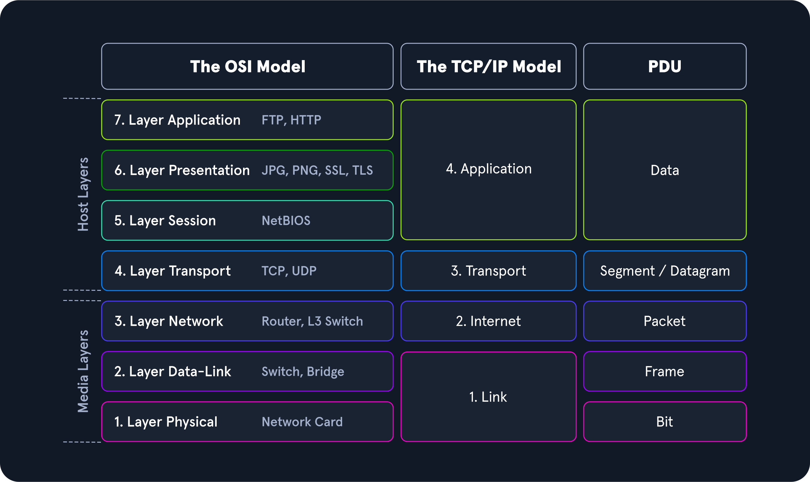

## PDU Packet Breakdown
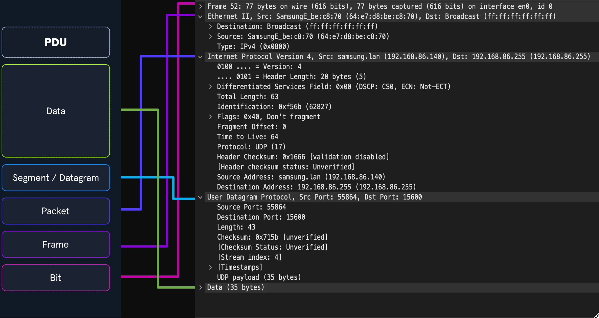

## The Statistics and Analyze Tabs

The Statistics and Analyze tabs can provide us with great insight into the data we are examining. From these points, we can utilize many of the baked-in plugins Wireshark has to offer.

The plugins here can give us detailed reports about the network traffic being utilized. It can show us everything from the top talkers in our environment to specific conversations and even breakdown
by IP and protocol.

### Statistics Tab

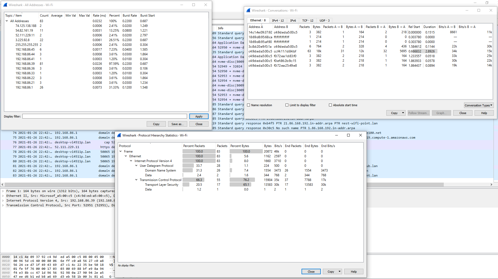

### Analyze

From the Analyze tab, we can utilize plugins that allow us to do things such as following TCP streams, filter on conversation types, prepare new packet filters and examine the expert info Wireshark
generates about the traffic. Below are a few examples of how to use these plugins.

### Analyze Tab

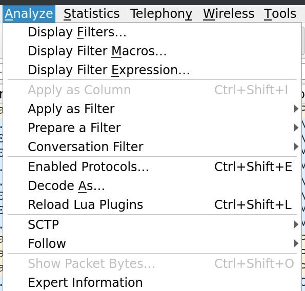

### Following TCP Streams

Wireshark can stitch TCP packets back together to recreate the entire stream in a readable format. This ability also allows us to pull data (`images`, `files`, `etc`.) out of the capture. This works
for almost any protocol that utilizes TCP as a transport mechanism.

To utilize this feature:

* right-click on a packet from the stream we wish to recreate.
* select follow → TCP
* this will open a new window with the stream stitched back together. From here, we can see the entire conversation.

Alternatively, we can utilize the filter `tcp.stream eq #` to find and track conversations captured in the pcap file.

## Filter For A Specific TCP Stream

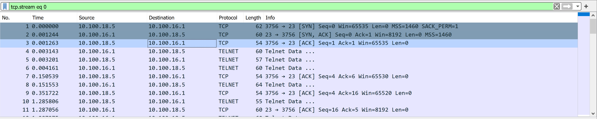

Notice that the first three packets in the image above have a full TCP handshake. Following those packets, we can see the stream transferring data. We have cleared anything not related out of view by
utilizing the filter, and we now can see the conversation in order.

### Extracting Data and Files From a Capture

Wireshark can recover many different types of data from streams. It requires you to have captured the entire conversation. Otherwise, this ability will fail to put an incomplete datagram back
together.

To extract files from a stream:

* stop your capture.
* Select the File radial → Export → , then select the protocol format to extract from.
* (DICOM, HTTP, SMB, etc.)

### Extract Files From The GUI

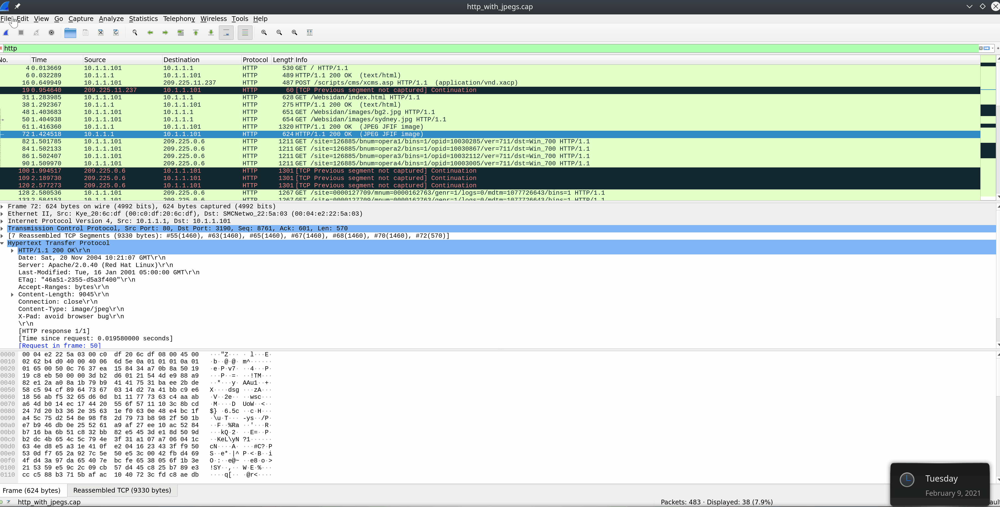

Another exciting way to grab data out of the pcap file comes from FTP. The File Transfer Protocol moves data between a server and host to pull it out of the raw bytes and reconstruct the file. (image,
text documents, etc.)

## FTP

* `ftp` - Will display anything about the FTP protocol.
    * We can utilize this to get a feel for what hosts/servers are transferring data over FTP.

### FTP Disector

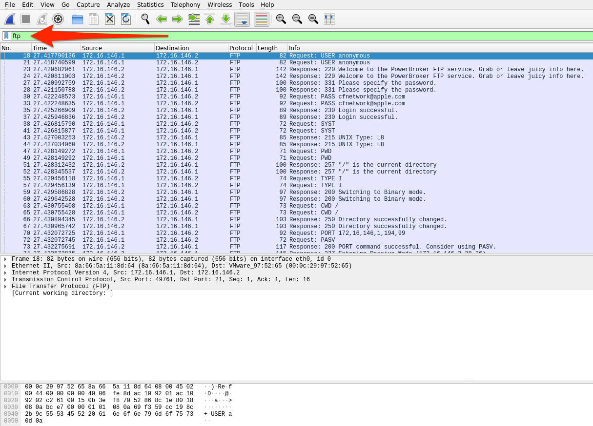

* `ftp.request.command` - Will show any commands sent across the ftp-control channel ( port 21 )
    * We can look for information like usernames and passwords with this filter. It can also show us filenames for anything requested.

### FTP-Request-Command Filter

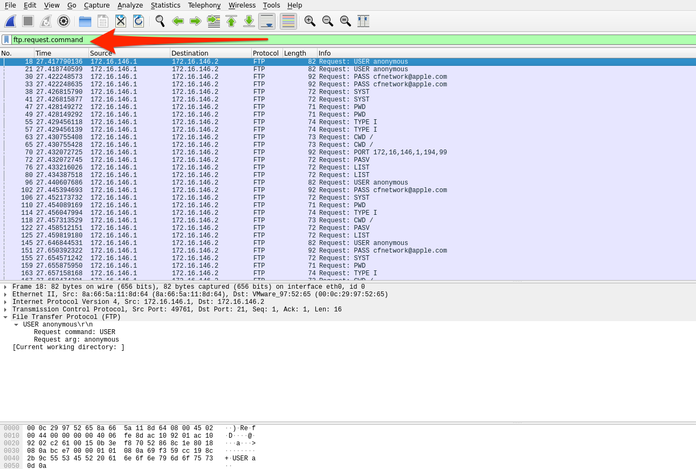

* `ftp-data` - Will show any data transferred over the data channel ( port 20 )
    * If we filter on a conversation and utilize `ftp-data`, we can capture anything sent during the conversation. We can reconstruct anything transferred by placing the raw data back into a new file
      and naming it appropriately.

### FTP-Data Filter

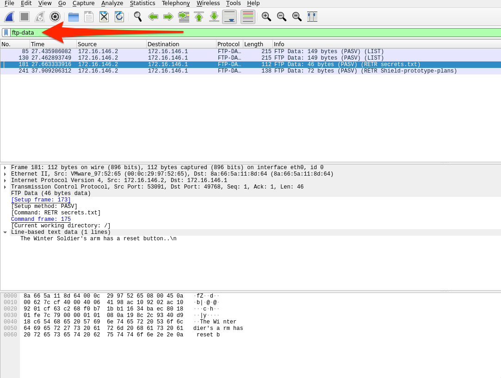
Since FTP utilizes TCP as its transport mechanism, we can utilize the `follow tcp stream` function we utilized earlier in the section to group any conversation we wish to explore

The basic steps to dissect FTP data from a pcap are as follows:

1. Identify any FTP traffic using the `ftp` display filter.
2. Look at the command controls sent between the server and hosts to determine if anything was transferred and who did so with the `ftp.request.command` filter.
3. Choose a file, then filter for `ftp-data`. Select a packet that corresponds with our file of interest and follow the TCP stream that correlates to it.
4. Once done, Change "`Show and save data as`" to "`Raw`" and save the content as the original file name.
5. Validate the extraction by checking the file type.

## Decrypting RDP connections

The purpose of this lab is to give a taste of the power Wireshark has. In this lab, we will be working with RDP traffic. If one has the required key utilized between the two hosts for encrypting the
traffic, Wireshark can deobfuscate the traffic for us.

### Tasks:

## Task #1

**Open the rdp.pcapng file in Wireshark.**

Unzip the zip file included in the optional resources and open it in Wireshark.

## Task #2

**Analyze the traffic included.**

Take a minute to look at the traffic. Notice there is a lot of information here. We know our focus is on RDP, so let's take a second to filter on `rdp` and see what it returns.

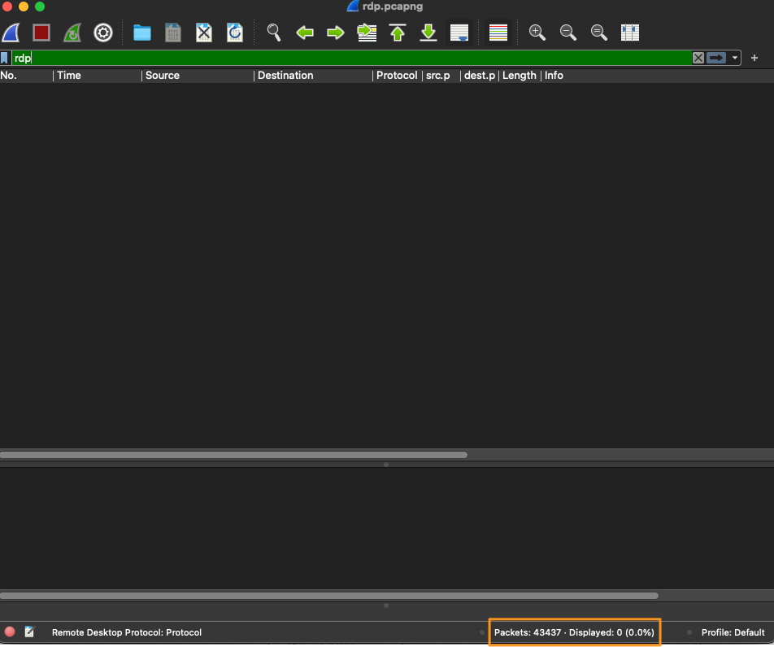

As it stands, not much can be seen, right? This is because RDP, by default, is utilizing TLS to encrypt the data, so we will not be able to see anything that happened with RDP traffic. How can we
verify its existence in this file? One way is to filter on the well-known port RDP uses typically.

**Filter on port 3389 to determine if any RDP traffic encrypted or otherwise exists.**

* `tcp.port == 3389`

We can at least verify that a session was established between the two hosts over TCP port 3389.

## Task #3

**Provide the RDP-key to Wireshark so it can decrypt the traffic.**

Now, let's take this a step further and use the key we found to try and decrypt the traffic.

To apply the key in Wireshark:

1. go to Edit → Preferences → Protocols → TLS
2. On the TLS page, select Edit by RSA keys list → a new window will open.
3. Follow the steps below to import the RSA server key.

## Import An RDP Key

Steps

1. Click the + to add a new key
2. Type in the IP address of the RDP server `10.129.43.29`
3. Type in the port used `3389`
4. Protocol filed equals `tpkt` or `blank`.
5. Browse to the `server.key` file and add it in the key file section.
6. Save and refresh your pcap file.

When filtering once again on RDP, we should see some traffic in the display.

## RDP In The Clear
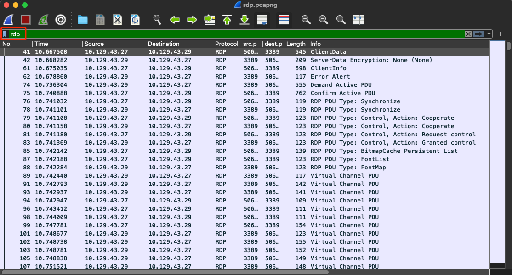
