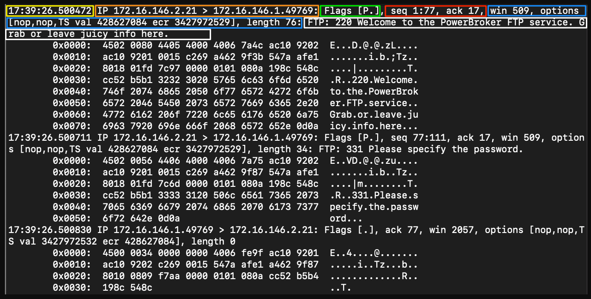

# [Intro To Network Traffic Analysis Module Cheat Sheet.pdf](./Intro_To_Network_Traffic_Analysis_Module_Cheat_Sheet.pdf)

## TCPDUMP

`Tcpdump` is a command-line packet sniffer that can directly capture and interpret data frames from a file or network interface. It was built for use on any Unix-like operating system and had a
Windows twin called `WinDump`.

### Install Tcpdump

```bash
  sudo apt install tcpdump
```

### Traffic Captures with Tcpdump

Below is a table of basic Tcpdump switches we can use to modify how our captures run. These switches can be chained together to craft how the tool output is shown to us in STDOUT and what is saved to
the capture file `.PCAP`

| Switch      | Command       | Result                                                               |
|-------------|---------------|----------------------------------------------------------------------|
| D           | -D            | Will display any interfaces available to capture from.               |
| i           | -i eth0       | Selects an interface to capture from. ex. -i eth0                    |
| n           | -n            | Do not resolve hostnames.                                            |
| nn          | -nn           | Do not resolve hostnames or well-known ports.                        |
| e           | -e            | Will grab the ethernet header along with upper-layer data.           |
| X           | -X            | Show Contents of packets in hex and ASCII.                           |
| XX          | -XX           | Same as X, but will also specify ethernet headers. (like using Xe)   |
| v, vv, vvv  | -v, -vv, -vvv | Increase the verbosity of output shown and saved.                    |
| c           | -c            | Grab a specific number of packets, then quit the program.            |
| s           | -s            | Defines how much of a packet to grab.                                |
| S           | -S            | Change relative sequence numbers in the capture display to absolute. |
| q           | -q            | Print less protocol information.                                     |
| r file.pcap | -r file.pcap  | Read from a file.                                                    |
| w file.pcap | -w file.pcap  | Write into a file                                                    |

### Listing Available Interfaces

```bash
  sudo tcpdump -D
  # 1.eth0 [Up, Running, Connected]
  # 2.any (Pseudo-device that captures on all interfaces) [Up, Running]
  # 3.lo [Up, Running, Loopback]
  # 4.bluetooth0 (Bluetooth adapter number 0) [Wireless, Association status unknown]
  # 5.bluetooth-monitor (Bluetooth Linux Monitor) [Wireless]
```

### Choosing an Interface to Capture From

```bash
  sudo tcpdump -i eth0
```

### Disable Name Resolution

```bash
  sudo tcpdump -i eth0 -nn
```

### Display the Ethernet Header

```bash
  sudo tcpdump -i eth0 -e
```

### Include ASCII and Hex Output

```bash
  sudo tcpdump -i eth0 -X
```

### Tcpdump Switch Combinations

```bash
  sudo tcpdump -i eth0 -nnvXX
```

## Tcpdump Output



| Filter                               | Result                                                                                                                                                                                                                                                                                          |
|--------------------------------------|-------------------------------------------------------------------------------------------------------------------------------------------------------------------------------------------------------------------------------------------------------------------------------------------------|
| Timestamp                            | Yellow The timestamp field comes first and is configurable to show the time and date in a format we can ingest easily.                                                                                                                                                                          |
| Protocol                             | Orange This section will tell us what the upper-layer header is. In our example, it shows IP.                                                                                                                                                                                                   |
| Source & Destination IP.Port         | Orange This will show us the source and destination of the packet along with the port number used to connect. Format == IP.port == 172.16.146.2.21                                                                                                                                              |
| Flags                                | Green This portion shows any flags utilized.                                                                                                                                                                                                                                                    |
| Sequence and Acknowledgement Numbers | Red This section shows the sequence and acknowledgment numbers used to track the TCP segment. Our example is utilizing low numbers to assume that relative sequence and ack numbers are being displayed.                                                                                        |
| Protocol Options                     | Blue Here, we will see any negotiated TCP values established between the client and server, such as window size, selective acknowledgments, window scale factors, and more.                                                                                                                     |
| Notes / Next Header                  | White Misc notes the dissector found will be present here. As the traffic we are looking at is encapsulated, we may see more header information for different protocols. In our example, we can see the TCPDump dissector recognizes FTP traffic within the encapsulation to display it for us. |

## File Input/Output with Tcpdump

### Save our PCAP Output to a File

```bash
  sudo tcpdump -i eth0 -w ~/output.pcap
```

### Reading Output From a File

```bash
  sudo tcpdump -r ~/output.pcap
```

## Tcpdump Packet Filtering

### Tcpdump Packet Filtering

| Filter               | Result                                                                                                   |
|----------------------|----------------------------------------------------------------------------------------------------------|
| host                 | `host` will filter visible traffic to show anything involving the designated host. Bi-directional        |
| src / dst            | `src` and `dst` are modifiers. We can use them to designate a source or destination host or port.        |
| net                  | `net` will show us any traffic sourcing from or destined to the network designated. It uses / notation.  |
| proto                | will filter for a specific protocol type. (ether, TCP, UDP, and ICMP as examples)                        |
| port                 | `port` is bi-directional. It will show any traffic with the specified port as the source or destination. |
| portrange            | `portrange` allows us to specify a range of ports. (0-1024)                                              |
| less / greater "< >" | `less` and `greater` can be used to look for a packet or protocol option of a specific size.             |
| and / &&             | `and` `&&` can be used to concatenate two different filters together. for example, src host AND port.    |
| or                   | `or` allows for a match on either of two conditions. It does not have to meet both. It can be tricky.    |
| not                  | `not` is a modifier saying anything but x. For example, not UDP.                                         || Filter           | Result                                                                                                 |

### Host Filter

When using the `host` filter, whatever IP we input will be checked for in the source or destination IP field. This can be seen in the output below.

```bash
  sudo tcpdump -i eth0 host 172.16.146.2
```

### Source/Destination Filter

```bash
  ### Syntax: src/dst [host|net|port] [IP|Network Range|Port]
  sudo tcpdump -i eth0 src host 172.16.146.2
  #
  tcpdump -nnr TCPDump-lab-2.pcap dst port http or https

```

Source and destination allow us to work with the directions of communication. For example, in the last output, we have specified that our `source` host is `172.16.146.2`, and only packets sent from
this host will be intercepted. This can be done for ports, and network ranges as well. An example of this utilizing `src` `port` `#` would look something like this:

### Utilizing Source With Port as a Filter

```bash
  sudo tcpdump -i eth0 tcp src port 80
```

### Using Destination in Combination with the Net Filter

```bash
  sudo tcpdump -i eth0 dst net 172.16.146.0/24
```

### Protocol Filter - Common Name

```bash
  ### Syntax: [tcp/udp/icmp]
  sudo tcpdump -i eth0 udp
```

### Protocol Filter - Number

```bash
  ### Syntax: [proto] [#]
  sudo tcpdump -i eth0 proto 17
```

### Port Filter

If we are looking to capture all HTTP traffic, utilizing tcp port 80 will ensure we only see HTTP traffic.

With protocols that use both TCP and UDP for different functions, such as DNS, we can filter looking at one or the other `TCP/UDP port 53` or filter for `port 53`. By doing this, we will see any
traffic-utilizing that port, regardless of the transport protocol.

```bash
  ### Syntax: [tcp/udp] port [#]
  sudo tcpdump -i eth0 tcp port 80
```

### Port Range Filter

The `portrange` filter, as seen below, allows us to see everything from within the port range. In the example, we see some DNS traffic along with some HTTP web requests.

```bash
  ### Syntax: portrange [portrange 0-65535]
  sudo tcpdump -i eth0 portrange 0-1024
```

### Less/Greater Filter

We are looking for any packet less than 64 bytes. From the following output, we can see that for this capture, those packets mainly consisted of `SYN`, `FIN`, or `KeepAlive` packets
To demonstrate, we can utilize `greater 500` (alternatively `'>500'`), which will only show us packets with a size larger than 500 bytes.

```bash
  ### Syntax: less/greater [size in bytes]
  sudo tcpdump -i eth0 less 64
```

### AND Filter

```bash
  ### Syntax: [filter] and [filter]
  sudo tcpdump -i eth0 host 192.168.0.1 and port 23
```

### OR Filter

```bash
  ### Syntax: [filter] or/|| [filter]
  sudo tcpdump -r sus.pcap icmp or host 172.16.146.1
```

### NOT Filter

```bash
  ### Syntax: not/! [filter]
  sudo tcpdump -r sus.pcap not icmp
```

## Interpreting Tips and Tricks

Using the `-S` switch will display absolute sequence numbers, which can be extremely long. Typically, tcpdump displays relative sequence numbers, which are easier to track and read. However, if we
look for these values in another tool or log, we will only find the packet based on absolute sequence numbers. For example, 13245768092588 to 100.

The `-v`, `-X`, and `-e` switches can help you increase the amount of data captured, while the `-c`, `-n`, `-s`, `-S`, and `-q` switches can help reduce and modify the amount of data written and seen.

Many handy options that can be used but are not always directly valuable for everyone are the `-A` and `-l` switches. A will show only the ASCII text after the packet line, instead of both ASCII and
Hex.`L` will tell tcpdump to output packets in a different mode. `L` will line buffer instead of pooling and pushing in chunks. It allows us to send the output directly to another tool such as grep
using a pipe `|`.

### Piping a Capture to Grep

In this case, we used the `-l` to pass the output to grep and looking for any instance of the phrase `mailto:*`

```bash
  sudo tcpdump -Ar http.cap -l | grep 'mailto:*'
  # reading from file http.cap, link-type EN10MB (Ethernet), snapshot length 65535
  #   <a href="mailto:ethereal-web[AT]ethereal.com">ethereal-web[AT]ethereal.com</a>
  #   <a href="mailto:free-support[AT]thewrittenword.com">free-support[AT]thewrittenword.com</a>
```

## Looking for TCP Protocol Flags

### Hunting For a SYN Flag

This is counting to the 13th byte in the structure and looking at the 2nd bit. If it is set to 1 or ON, the SYN flag is set.

```bash
  sudo tcpdump -i eth0 'tcp[13] &2 != 0'
```