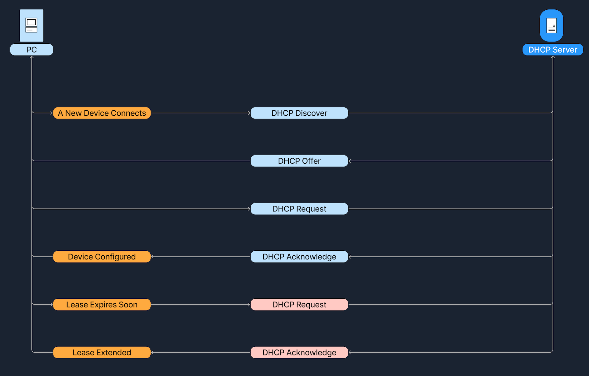
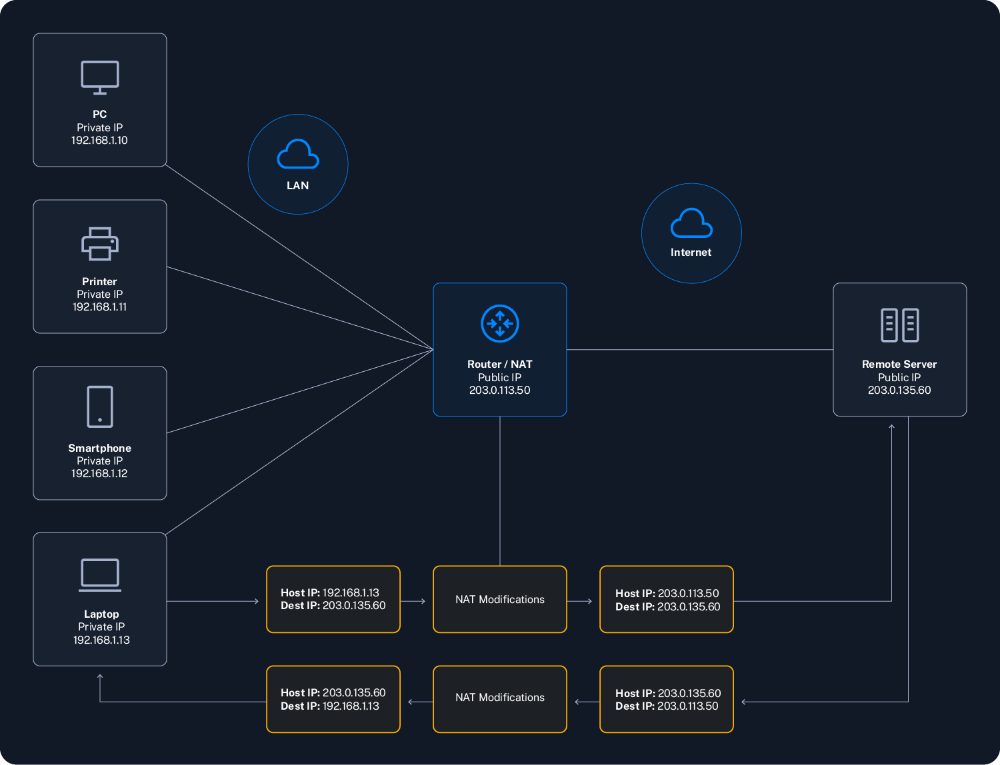
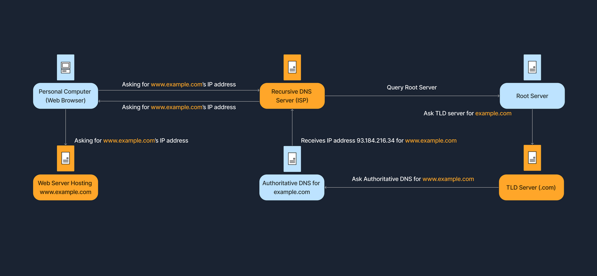
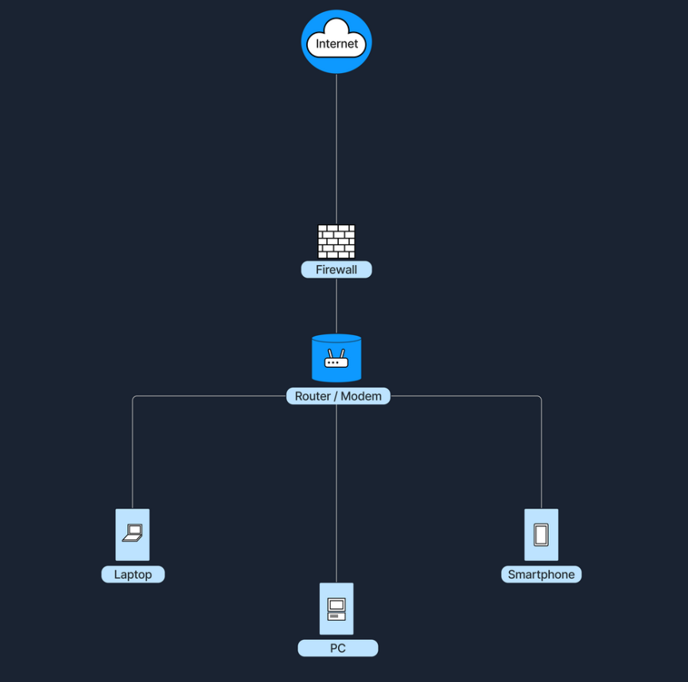
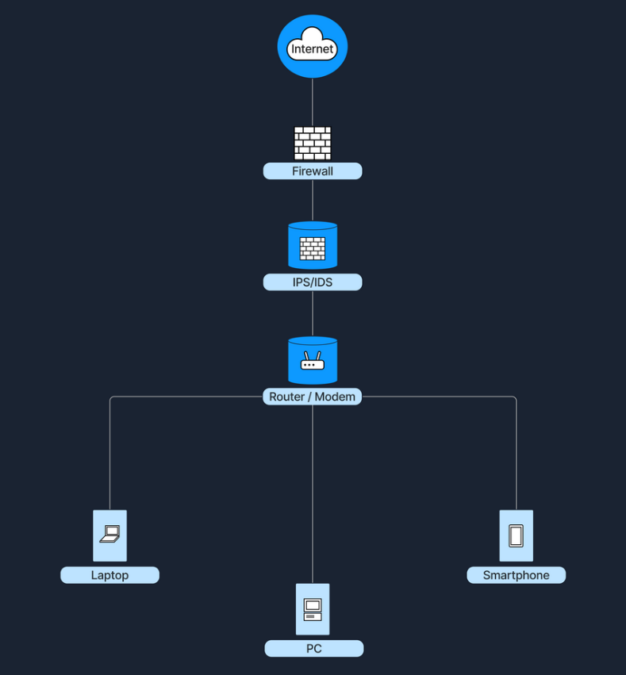

# Network Foundations

## Dynamic Host Configuration Protocol (DHCP)



## Network Address Translation (NAT)

### Types of NAT

1. **Static NAT**: Maps a specific private IP address to a specific public IP address.
2. **Dynamic NAT**: Maps private IP addresses to a pool of public IP addresses on a first-come, first-served basis.
3. **Port Address Translation (PAT)**: Also known as NAT overload, it maps multiple private IP addresses to a single public IP address by using different ports.



## Domain Name System (DNS)

### DNS Hierarchy

DNS is organized like a tree, starting from the root and branching out into different layers.

| Layer                      | Description                                                                       |
| -------------------------- | --------------------------------------------------------------------------------- |
| `Root Servers`             | The top of the DNS hierarchy.                                                     |
| `Top-Level Domains (TLDs)` | Such as `.com, `.org, `.net`, or country codes like `.uk`, `.de`.                 |
| `Second-Level Domains`     | For example, example in example.com.                                              |
| `Subdomains or Hostname`   | For instance, `www` in `www.example.com`, or `accounts` in `accounts.google.com`. |




## Network Security

The goal is to uphold and maintain the CIA triad:

- **Confidentiality:** Only authorized users can view the data.
- **Integrity:** The data remains accurate and unaltered.
- **Availability:** Network resources are accessible when needed.

### Firewalls

Network security device, either hardware, software, or a combination of both, that monitors incoming and outgoing network traffic

1. Packet Filtering Firewall
2. Stateful Inspection Firewall
3. Application Layer Firewall (Proxy Firewall)
4. Next-Generation Firewall (NGFW)

> Note: The open source router/firewall [pfSense](https://www.pfsense.org/). Its large number of plugins (known as "Packages") give it a range of capabilities.

Stand between the internet and the internal network, examining traffic before letting it through.



### Intrusion Detection and Prevention Systems (IDS/IPS)

Security solutions designed to monitor and respond to suspicious network or system activity.

1. Network-Based IDS/IPS (NIDS/NIPS)
2. Host-Based IDS/IPS (HIDS/HIPS)

> Note: The widely used [Suricata](https://suricata.io/) software can function as both an IDS and an IPS. Here, we see the user enable a detection rule, then begin inline monitoring.



### Best Practices

1. **Define Clear Policies:** Rules based on the principle of `least privilege` (only allow what is necessary).
2. **Regular Updates** Keep firewall, IDS/IPS signatures, and operating systems up to date to defend against the latest threats.
3. **Monitor and Log Events** Regularly review firewall logs, IDS/IPS alerts, and system logs to identify suspicious patterns early.
4. **Layered Security** Use defense in depth (a strategy that leverages multiple security measures to slow down an attack) with multiple layers: Firewalls, IDS/IPS, antivirus, and endpoint protection to cover different attack vectors.
5. **Periodic Penetration Testing** Test the effectiveness of the security policies and devices by simulating real attacks.

## Having Tuns of Fun

Route taken for any traffic sent from the Pwnbox to reach the target.

```bash
ip route get <target ip>
# 10.129.233.197 via 10.10.14.1 dev tun0 src 10.10.14.52 uid 1002
#    cache
```

```bash
ping -c 4 <target ip>
# 64 bytes from 10.129.233.197: icmp_seq=1 ttl=127 time=71.6 ms
# 64 bytes from 10.129.233.197: icmp_seq=2 ttl=127 time=71.3 ms
# 64 bytes from 10.129.233.197: icmp_seq=3 ttl=127 time=71.8 ms
```

- **ttl**: `time-to-live`, tells us how many "hops" our packets are allowed to take in order to reach the target.
- **time**: gives us an idea of how much latency there is on the network

```bash
nmap <target ip>
# Starting Nmap 7.94SVN ( https://nmap.org ) at 2025-02-08 18:07 CST
# Nmap scan report for 10.129.233.197
# Host is up (0.073s latency).
# Not shown: 993 closed tcp ports (reset)
# PORT     STATE SERVICE
# 21/tcp   open  ftp
# 80/tcp   open  http
# 135/tcp  open  msrpc
# 139/tcp  open  netbios-ssn
# 445/tcp  open  microsoft-ds
# 3389/tcp open  ms-wbt-server      # Remote Desktop Protocol, RDP
# 5357/tcp open  wsdapi             # Microsoft's Web Services for Devices API
```

### FTP (File Transfer Protocol)

```bash
nc <target ip> 21
# 220 Microsoft FTP Service
USER anonymous[Ctrl+V][Enter][Enter]
PASS anything[Ctrl+V][Enter][Enter]
PASV[Ctrl+V][Enter][Enter]
# 227 Entering Passive Mode (10,129,233,197,194,40).
```

> Note: The reason we provided the `[Ctrl + V] [Enter] [Enter]` is because FTP requires a `return character and new-line character (\r\n)` for its commands. When we press Enter on our keyboard, Netcat only sends the `\n`.

FTP (File Transfer Protocol) uses two separate channels for its operations:

| Channel         | Purpose                                           | Port                                              |
| --------------- | ------------------------------------------------- | ------------------------------------------------- |
| Control Channel | Sends FTP commands (USER, PASS, LIST, RETR, etc.) | Port 21                                           |
| Data Channel    | Transfers files and directory listings            | Dynamic Port (Varies by mode: Active or Passive). |

Here, we have selected passive mode, and subsequently need to re-connect to the FTP server on another port. To determine the port number, we need to do some calculations `p1*256 + p2`, where `p1` and `p2` are the last two numbers in the IP address provided by the server (`194` and `40` in this case).

Let's open a new Parrot Terminal and connect to the FTP server on the new port:

```bash
nc <target ip> 49704
# Connection to 10.129.233.197 49704 port [tcp/*] succeeded!
```

Now, let's return to our first Terminal and use the `connection channel` to list the available files in the FTP share. Enter the following command:

```bash
LIST[Ctrl+V][Enter][Enter]
# 125 Data connection already open; Transfer starting.
# 226 Transfer complete.
```

When we check back on our other Terminal, we will see a list of the files available in the share!

```bash 
# 02-08-25  09:37PM                  438 Note-From-IT.txt
```

We see that there is a `Note-From-IT.txt` text file available for us to read. To retrieve the file, we must once again enter the following command in our `connection channel`, then use netcat to establish connection to a new `data channel`.

```bash
PASV[Ctrl + V][Enter][Enter]
# 227 Entering Passive Mode (10,129,233,197,194,50).
```

Again, we must calculate the port number, and use netcat to make the connection.

- `194 * 256 + 50 = 49714`

```bash
nc -v <target ip> 49714
```

Sending one final command, we can retrieve the Note-From-IT.txt text file.

```bash
RETR Note-From-IT.txt[Ctrl + V][Enter][Enter]
# 125 Data connection already open; Transfer starting.
# 226 Transfer complete.
```

When we check the data channel, we are greeted with the contents of the note.

```bash
# Connection to 10.129.233.197 49680 port [tcp/*] succeeded!
# Bertolis,
# ......
``` 

### HTTP (Hypertext Transfer Protocol)

```bash
nc <target ip> 80
GET / HTTP/1.1[enter]
Host: <target ip>[enter]
User-Agent: Server Administrator[enter][enter]

# HTTP/1.1 200 OK
# Content-Type: text/html
# Accept-Ranges: bytes
# .....
```