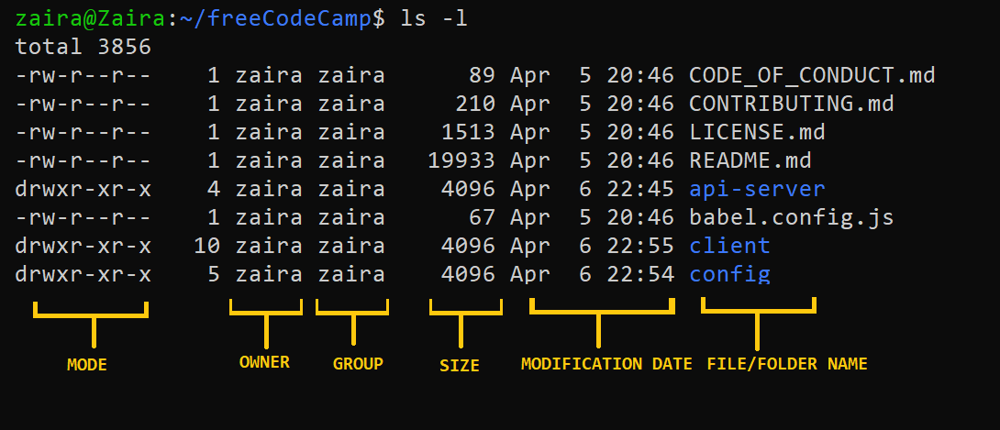

# File Permissions

<!-- TOC -->
* [File Permissions](#file-permissions)
  * [Access control: finding and understanding file permission](#access-control-finding-and-understanding-file-permission)
  * [How to Read Symbolic Permissions or the `rwx` permissions](#how-to-read-symbolic-permissions-or-the-rwx-permissions)
  * [How to Change File Permissions and Ownership in Linux using `chmod` and `chown`](#how-to-change-file-permissions-and-ownership-in-linux-using-chmod-and-chown)
    * [Sticky bit](#sticky-bit)
  * [How to Change Ownership using the `chown` Command](#how-to-change-ownership-using-the-chown-command)
<!-- TOC -->

## Access control: finding and understanding file permission

File ownership can be viewed using the `ls -l` command.



Let's have a closer look into the `mode` column:


Mode defines two things:

* **File type:** File type defines the type of the file. For regular files that contain simple data it is blank -. For other special file types the
  symbol is different. For a directory which is a special file, it is d. Special files are treated differently by the OS.
* **Permission classes:** The next set of characters define the permissions for user, group, and others respectively.
    1. – **User**: This is the owner of a file and owner of the file belongs to this class.
    2. – **Group**: The members of the file’s group belong to this class
    3. – **Other**: Any users that are not part of the user or group classes belong to this class.

> 💡Tip: Directory ownership can be viewed using the `ls -ld` command.

## How to Read Symbolic Permissions or the `rwx` permissions

The `rwx` representation is known as the Symbolic representation of permissions. In the set of permissions,

* `r` stands for read. It is indicated in the first character of the triad.
* `w` stands for write. It is indicated in the second character of the triad.
* `x` stands for execution. It is indicated in the third character of the triad.

## How to Change File Permissions and Ownership in Linux using `chmod` and `chown`

Syntax of chmod:

`chmod permissions filename`

Where,

* `permissions` can be **read**, **write**, **execute** or a combination of them.
* `filename` is the name of the file for which the permissions need to change. This parameter can also be a list if files to change permissions in
  bulk.

We can change permissions using two modes:

1. Symbolic mode: this method uses symbols like `u`, `g`, `o` to represent **users**, **groups**, and **others**. Permissions are represented as
   `r`, `w`, `x` for **read**, **write**, and **execute**, respectively. You can modify permissions using `+`, `-` and `=`.
2. Absolute mode: this method represents permissions as 3-digit octal numbers ranging from 0-7.
   * 0 - No permission
   * 1 - execution
   * 2 - write
   * 4 - read

| OPERATOR | DESCRIPTION                                                                               |
|----------|-------------------------------------------------------------------------------------------|
| +        | Adds a permission to a file or directory                                                  |
| –        | Removes the permission                                                                    |
| \=       | Sets the permission if not present before. Also overrides the permissions if set earlier. |

**Example:**

To add execution rights **(x)** to owner **(u)** using symbolic mode, we can use the command below:
`chmod u+x mymotd.sh`

**Additional examples for changing permissions via symbolic method:**

* Removing `read` and `write` permission for `group` and `others`: `chmod go-rw`.
* Removing `read` permissions for `others`: `chmod o-r`.
* Assigning `write` permission to `group` and **overriding existing permission**: `chmod g=w`.

### Sticky bit

The sticky bit is a special permission that can be set on directories. When the sticky bit is set, only the owner of a file in that directory can delete or rename the file. This is useful for shared
directories where multiple users have write access.

* `-t` is the sticky bit permission in the execute position of the others class.
* `-T` is the sticky bit permission in the execute position of the others class when the execute permission is not set.

To set the sticky bit on a directory, use the `chmod` command with the `+t` option:

```bash
chmod +t /path/to/directory
```

## How to Change Ownership using the `chown` Command

You can change the ownership of a file or folder using the `chown` command

Syntax of chown:

`chown user filename`

**How to change user ownership with chown**

Let's transfer the ownership from user zaira to user news.

`chown news mymotd.sh`

**How to change user and group ownership simultaneously**

`chown user:group filename`

**How to change directory ownership**

You can change ownership recursively for contents in a directory

`chown -R admin /opt/script`

**How to change group ownership**

In case we only need to change the group owner, we can use `chown` by preceding the group name by a colon `:`

`chown :admins /opt/script`