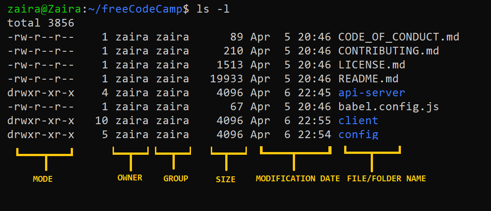
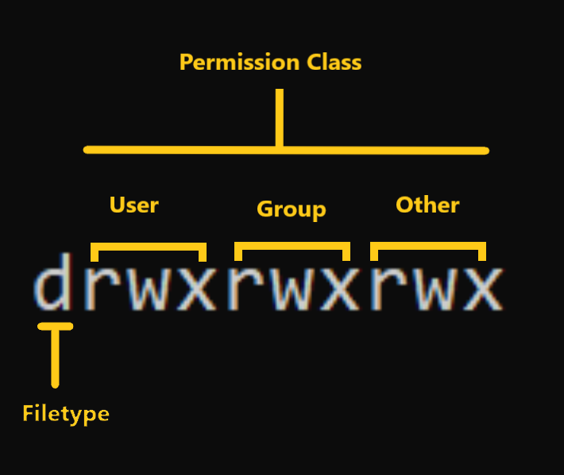

# Linux

https://www.freecodecamp.org/news/learn-linux-for-beginners-book-basic-to-advanced/

<!-- TOC -->
* [Linux](#linux)
  * [CPU architecture](#cpu-architecture)
  * [The Linux File-system Hierarchy](#the-linux-file-system-hierarchy)
  * [`cd` Command shortcuts](#cd-command-shortcuts)
  * [create directories recursively using the `-p` option](#create-directories-recursively-using-the--p-option)
  * [Creating new files using the `touch` command](#creating-new-files-using-the-touch-command)
  * [Removing files and directories using the `rm` and `rmdir` command](#removing-files-and-directories-using-the-rm-and-rmdir-command)
  * [Moving and renaming files and folders using the `mv` command](#moving-and-renaming-files-and-folders-using-the-mv-command)
  * [Locating Files and Folders Using the `find` Command](#locating-files-and-folders-using-the-find-command)
    * [How to search files by name or extension](#how-to-search-files-by-name-or-extension)
    * [How to search hidden files](#how-to-search-hidden-files)
    * [How to search log files and configuration files](#how-to-search-log-files-and-configuration-files)
    * [How to search other files by type](#how-to-search-other-files-by-type)
    * [How to search directories](#how-to-search-directories)
    * [How to search files by size](#how-to-search-files-by-size)
    * [How to search files by modification time](#how-to-search-files-by-modification-time)
  * [Concatenate and display files using the `cat` command](#concatenate-and-display-files-using-the-cat-command)
  * [Viewing text files interactively using `less` and `more`](#viewing-text-files-interactively-using-less-and-more)
  * [Displaying the last part of files using `tail`](#displaying-the-last-part-of-files-using-tail)
  * [Displaying the beginning of files using `head`](#displaying-the-beginning-of-files-using-head)
  * [Counting words, lines, and characters using `wc`](#counting-words-lines-and-characters-using-wc)
  * [Comparing files line by line using `diff`](#comparing-files-line-by-line-using-diff)
    * [Check whether the files are the same or not](#check-whether-the-files-are-the-same-or-not)
    * [See how the files differ. For that, you can use the `-u` flag to see a unified output:](#see-how-the-files-differ-for-that-you-can-use-the--u-flag-to-see-a-unified-output)
    * [To see the diff in a side-by-side format, you can use the `-y` flag:](#to-see-the-diff-in-a-side-by-side-format-you-can-use-the--y-flag)
  * [How to Create and Execute Bash scripts](#how-to-create-and-execute-bash-scripts)
    * [Creating your first bash script](#creating-your-first-bash-script)
    * [Executing the bash script](#executing-the-bash-script)
    * [Comments in bash scripting](#comments-in-bash-scripting)
    * [Variables and data types in Bash](#variables-and-data-types-in-bash)
    * [Conditional statements (if/else)](#conditional-statements-ifelse)
    * [Syntax of bash conditional statements](#syntax-of-bash-conditional-statements)
    * [Looping and branching in Bash](#looping-and-branching-in-bash)
    * [While loop](#while-loop)
    * [For loop](#for-loop)
    * [Case statements](#case-statements)
  * [Managing Software Packages in Linux](#managing-software-packages-in-linux)
    * [Installing downloaded packages from a website](#installing-downloaded-packages-from-a-website)
  * [User Management](#user-management)
    * [Access control: finding and understanding file permission](#access-control-finding-and-understanding-file-permission)
    * [How to Read Symbolic Permissions or the `rwx` permissions](#how-to-read-symbolic-permissions-or-the-rwx-permissions)
    * [How to Change File Permissions and Ownership in Linux using `chmod` and `chown`](#how-to-change-file-permissions-and-ownership-in-linux-using-chmod-and-chown)
    * [How to Change Ownership using the `chown` Command](#how-to-change-ownership-using-the-chown-command)
  * [Managing local user accounts](#managing-local-user-accounts)
    * [Creating users from the command line](#creating-users-from-the-command-line)
    * [Modifying existing users](#modifying-existing-users)
    * [Deleting users](#deleting-users)
    * [Changing user passwords](#changing-user-passwords)
  * [Connecting to Remote Servers via SSH](#connecting-to-remote-servers-via-ssh)
  * [Advanced Log Parsing and Analysis](#advanced-log-parsing-and-analysis)
    * [Text extraction using `grep`](#text-extraction-using-grep)
    * [Text extraction using `sed`](#text-extraction-using-sed)
    * [Text parsing with `awk`](#text-parsing-with-awk)
    * [Parsing log files with `cut`](#parsing-log-files-with-cut)
  * [Automation in Linux – Automate Tasks with Cron Jobs](#automation-in-linux--automate-tasks-with-cron-jobs)
    * [How to add cron jobs in Linux](#how-to-add-cron-jobs-in-linux)
    * [Cron job syntax](#cron-job-syntax)
    * [Cron job examples](#cron-job-examples)
    * [How to set up a cron job](#how-to-set-up-a-cron-job)
    * [How to troubleshoot crons](#how-to-troubleshoot-crons)
  * [Linux Networking Basics](#linux-networking-basics)
    * [View network interfaces with `ifconfig`](#view-network-interfaces-with-ifconfig)
    * [View network activity with `netstat`](#view-network-activity-with-netstat)
<!-- TOC -->

## CPU architecture

The `lscpu` command in Linux is used to display information about the CPU architecture. When you run lscpu in the
terminal, it provides details such as:

* The architecture of the CPU (for example, x86_64)
* CPU op-mode(s) (for example, 32-bit, 64-bit)
* Byte Order (for example, Little Endian)
* CPU(s) (number of CPUs), and so on

## The Linux File-system Hierarchy

| Location | Purpose                                                                     |
|:---------|:----------------------------------------------------------------------------|
| /bin     | Essential command binaries                                                  |
| /boot    | Static files of the boot loader, needed in order to start the boot process. |
| /etc     | Host-specific system configuration                                          |
| /home    | User home directories                                                       |
| /root    | Home directory for the administrative root user                             |
| /lib     | Essential shared libraries and kernel modules                               |
| /mnt     | Mount point for mounting a filesystem temporarily                           |
| /opt     | Add-on application software packages                                        |
| /usr     | Installed software and shared libraries                                     |
| /var     | Variable data that is also persistent between boots                         |
| /tmp     | Temporary files that are accessible to all users                            |

> You can check your file system using the `tree -d -L 1` command. **You can modify the -L flag to change the depth of
the tree**.

## `cd` Command shortcuts

| Command      | 	Description              |
|:-------------|:--------------------------|
| `cd .. `     | 	Go back one directory    |
| `cd ../..`   | 	Go back two directories  |
| `cd or cd ~` | 	Go to the home directory |
| `cd -`       | 	Go to the previous path  |

## create directories recursively using the `-p` option

`mkdir -p tools/index/helper-scripts`

.
└── tools
    └── index
        └── helper-scripts

## Creating new files using the `touch` command

The touch command creates an empty file. You can use it like this:

`touch file.txt`

> The file names can be chained together if you want to create multiple files in a single command.
> `touch file1.txt file2.txt file3.txt`

## Removing files and directories using the `rm` and `rmdir` command

You can use the `rm` command to remove both files and non-empty directories

| Command           | 	Description                                                  |
|:------------------|:--------------------------------------------------------------|
| `rm file.txt`     | 	Removes the file file.txt                                    |
| `rm -r directory` | 	Removes the directory directory and its contents             |
| `rm -f file.txt`  | 	Removes the file file.txt without prompting for confirmation |
| `rmdir directory` | 	Removes an empty directory                                   |

> Note that you should use the `-f` flag with caution as you won't be asked before deleting a file. Also, be careful
> when running `rm` commands in the `root` folder as it might result in deleting important system files.

## Moving and renaming files and folders using the `mv` command

The `mv` command is used to move files and folders from one directory to the other.

`mv file1.txt backup/`

To move a directory and its contents:

`mv dir1/ backup/`

Renaming files and folders in Linux is also done with the `mv` command.

`mv file1.txt file2.txt`

Rename a directory from **dir1** to **dir2**:
`mv dir1 dir2`

## Locating Files and Folders Using the `find` Command

The `find` command lets you efficiently search for files, folders, and character and block devices.

`find /path/ -type f -name file-to-search`

* `/path` is the path where the file is expected to be found. This is the starting point for searching files. The path
  can also be/or . which represents the root and current directory, respectively.
* `-type` represents the file descriptors. They can be any of the below:
* `f` – Regular file such as text files, images, and hidden files.
* `d` – Directory. These are the folders under consideration.
* `l` – Symbolic link. Symbolic links point to files and are similar to shortcuts.
* `c` – Character devices. Files that are used to access character devices are called character device files. Drivers
  communicate with character devices by sending and receiving single characters (bytes, octets). Examples include
  keyboards, sound cards, and the mouse.
* `b` – Block devices. Files that are used to access block devices are called block device files. Drivers communicate
  with block devices by sending and receiving entire blocks of data. Examples include USB and CD-ROM
* `-name` is the name of the file type that you want to search.

### How to search files by name or extension

Suppose we need to find files that contain **"style"** in their name. We'll use this command:

`find . -type f -name "style*"`

Now let's say we want to find files with a particular extension like **.html**. We'll modify the command like this:

`find . -type f -name "*.html"`

### How to search hidden files

A dot at the beginning of the filename represents hidden files. They are normally hidden but can be viewed with `ls -a`
in the current directory.

We can modify the find command as shown below to search for hidden files:

`find . -type f -name ".*"`

### How to search log files and configuration files

Log files usually have the extension **.log**, and we can find them like this:

`find . -type f -name "*.log"`

Similarly, we can search for configuration files like this:

`find . -type f -name "*.conf"`

### How to search other files by type

We can search for character block files by providing `c` to `-type`:

`find / -type c`

Similarly, we can find device block files by using `b`:

`find / -type b`

### How to search directories

In the example below, we are finding the folders using the `-type d` flag.

`find . -type d `

### How to search files by size

An incredibly helpful use of the `find` command is to list files based on a particular size.

`find / -size +250M`

Here, we are listing files whose size exceeds 250MB.

Other units include:

* G: GigaBytes.
* M: MegaBytes.
* K: KiloBytes
* c : bytes.

Just replace with the relevant unit.

`find <directory> -type f -size +N<Unit Type>`

### How to search files by modification time

By using the `-mtime` flag, you can filter files and folders based on the modification time.

`find /path -name "*.txt" -mtime -10`

For example,

* -mtime +10 means you are looking for a file modified 10 days ago.
* -mtime -10 means less than 10 days.
* -mtime 10 If you skip + or – it means exactly 10 days.

## Concatenate and display files using the `cat` command

The `cat` command in Linux is used to display the contents of a file. It can also be used to concatenate files and
create new files.

Here is the basic syntax of the cat command:

`cat [options] [file]`

For example, if you want to view the contents of a file named **file.txt**, you can use the following command:

`cat file.txt`

This will display all the contents of the file on the terminal at once.

## Viewing text files interactively using `less` and `more`

While `cat` displays the entire file at once, `less` and `more` allow you to view the contents of a file interactively.
This is useful when you want to scroll through a large file or search for specific content.

The syntax of the less command is:

`less [options] [file]`

The `more` command is similar to `less` but has fewer features. It is used to display the contents of a file one screen
at a time.

The syntax of the `more` command is:

`more [options] [file]`

For both commands, you can use the `spacebar` to scroll one page down, the `Enter` key to scroll one line down, and the
`q` key to exit the viewer.

To move backward you can use the `b` key, and to move forward you can use the `f` key.

## Displaying the last part of files using `tail`

Sometimes you might need to view just the last few lines of a file instead of the entire file. The `tail` command in
Linux is used to display the last part of a file.

For example, `tail file.txt` will **display the last 10 lines of the file file.txt** by default.

If you want to display a different number of lines, you can use the `-n` option followed by the number of lines you want
to display.

`tail -n 50 file.txt`

> **Tip:** Another usage of the tail is its follow-along (`-f`) option. This option enables you to view the contents of
> a file as they are being written. This is a useful utility for viewing and monitoring log files in real-time.

## Displaying the beginning of files using `head`

Just like `tail` displays the last part of a file, you can use the `head` command in Linux to display the beginning of a
file.

For example, `head file.txt` will display the **first 10 lines of the file file.txt** by default.

To change the number of lines displayed, you can use the `-n` option followed by the number of lines you want to
display.

## Counting words, lines, and characters using `wc`

You can count words, lines and characters in a file using the wc command.

For example, running `wc syslog.log` gave me the following output:

**1669 9623 64367 syslog.log**

In the output above,

* 1669 represents the number of lines in the file **syslog.log**.
* 9623 represents the number of words in the file **syslog.log**.
* 64367 represents the number of characters in the file **syslog.log**.

## Comparing files line by line using `diff`

The basic syntax of the diff command is:

`diff [options] file1 file2`

\# contents of hello.py\
def greet(name):\
return f"Hello, {name}!"

user = input("Enter your name: ")\
print(greet(user))

\# contents of also-hello.py\
def greet(name):\
return fHello, {name}!

user = input(Enter your name: )\
print(greet(user))\
print("Nice to meet you")

### Check whether the files are the same or not

`diff -q hello.py also-hello.py`
> Output
>
>Files hello.py and also-hello.py differ

### See how the files differ. For that, you can use the `-u` flag to see a unified output:

`diff -u hello.py also-hello.py`

1. --- hello.py 2024-05-24 18:31:29.891690478 +0500
2. +++ also-hello.py 2024-05-24 18:32:17.207921795 +0500
3. @@ -3,4 +3,5 @@
4.
5. user = input(Enter your name: )
6. print(greet(user))
7. +print("Nice to meet you")

In the above output:

* `--- hello.py 2024-05-24 18:31:29.891690478 +0500` indicates the file being compared and its timestamp.
* `+++ also-hello.py 2024-05-24 18:32:17.207921795 +0500` indicates the other file being compared and its timestamp.
* `@@ -3,4 +3,5 @@` shows the line numbers where the changes occur. In this case, it indicates that lines 3 to 4 in the
  original file have changed to lines 3 to 5 in the modified file.
* `user = input(Enter your name: )` is a line from the original file.
* `print(greet(user))` is another line from the original file.
* `+print("Nice to meet you")` is the additional line in the modified file.

### To see the diff in a side-by-side format, you can use the `-y` flag:

`diff -y hello.py also-hello.py`

In the output:

* The lines that are the same in both files are displayed side by side.
* Lines that are different are shown with a `>` symbol indicating the line is only present in one of the files.

## How to Create and Execute Bash scripts

Bash scripts start with a **shebang**. **Shebang** is a combination of bash `#` and bang `!` followed by the **bash
shell path**.

`#!/bin/bash`

You can find your bash shell path (which may vary from the above) using the command:

`which bash`

### Creating your first bash script

1. #!/bin/bash
2. echo "Today is " `date`
3.
4. echo -e "\nenter the path to directory"
5. read the_path
6.
7. echo -e "\n you path has the following files and folders: "
8. ls $the_path

* Line #1: The shebang (`#!/bin/bash`) points toward the bash shell path.
* Line #2: The `echo` command displays the current date and time on the terminal. Note that the `date` is in backticks.
* Line #4: We want the user to enter a valid path.
* Line #5: The `read` command reads the input and stores it in the variable `the_path`.
* line #8: The `ls` command takes the variable with the stored path and displays the current files and folders.

### Executing the bash script

To make the script executable, assign execution rights to your user using this command:

`chmod u+x run_all.sh`

Here,

* `chmod` modifies the ownership of a file for the current user :`u`.
* `+x` adds the execution rights to the current user. This means that the user who is the owner can now run the script.
* `run_all.sh` is the file we wish to run.

You can run the script using any of the mentioned methods:

* `sh run_all.sh`
* `bash run_all.sh`
* `./run_all.sh`

### Comments in bash scripting

Comments start with a `#` in bash scripting. This means that any line that begins with a `#` is a comment and will be
ignored by the interpreter.

### Variables and data types in Bash

There are no data types in Bash. In Bash, a variable is capable of storing numeric values, individual characters, or
strings of characters.

**Assign the value directly:**

`country=Netherlands`

Assign the value based on the output obtained from a program or command, using command substitution.
> Note that `$` is required to access an existing variable's value.

`same_country=$country`

### Conditional statements (if/else)

Syntax:

`if [[ condition ]];
then
    statement
elif [[ condition ]]; then
    statement 
else
    do this by default
fi`

### Syntax of bash conditional statements

We can use logical operators such as **AND** `-a` and **OR** `-o` to make comparisons that have more significance.

`if [ $a -gt 60 -a $b -lt 100 ]`

### Looping and branching in Bash

### While loop

In the example below, `(( i += 1 ))` is the counter statement that increments the value of `i`. The loop will run
exactly 10 times.

`#!/bin/bash
i=1
while [[ $i -le 10 ]] ; do
   echo "$i"
  (( i += 1 ))
done`

### For loop

`#!/bin/bash
for i in {1..5}
do
    echo $i
done`

### Case statements

`case expression in
    pattern1)
        # code to execute if expression matches pattern1
        ;;
    pattern2)
        # code to execute if expression matches pattern2
        ;;
    pattern3)
        # code to execute if expression matches pattern3
        ;;
    *)
        # code to execute if none of the above patterns match expression
        ;;
esac`

The double semicolon `";;"` separates each block of code to execute for each pattern. The asterisk `"*"` represents the
default case, which executes if none of the specified patterns match the expression.

## Managing Software Packages in Linux

### Installing downloaded packages from a website

`sudo dpkg -i package_name.deb`

## User Management

There are three main types of user accounts:

1. Superuser: The superuser has complete access to the system. The name of the superuser is `root`. It has a `UID` of 0.
2. System user: The system user has user accounts that are used to run system services. These accounts are used to run system services and are not
   meant for human interaction.
3. Regular user: Regular users are human users who have access to the system.

The id command displays the user ID and group ID of the current user.
`id username`

### Access control: finding and understanding file permission

File ownership can be viewed using the `ls -l` command.

Let's have a closer look into the `mode` column:

Mode defines two things:

* **File type:** File type defines the type of the file. For regular files that contain simple data it is blank -. For other special file types the
  symbol is different. For a directory which is a special file, it is d. Special files are treated differently by the OS.
* **Permission classes:** The next set of characters define the permissions for user, group, and others respectively.
    1. – **User**: This is the owner of a file and owner of the file belongs to this class.
    2. – **Group**: The members of the file’s group belong to this class
    3. – **Other**: Any users that are not part of the user or group classes belong to this class.

> 💡Tip: Directory ownership can be viewed using the `ls -ld` command.

### How to Read Symbolic Permissions or the `rwx` permissions

The `rwx` representation is known as the Symbolic representation of permissions. In the set of permissions,

* `r` stands for read. It is indicated in the first character of the triad.
* `w` stands for write. It is indicated in the second character of the triad.
* `x` stands for execution. It is indicated in the third character of the triad.

### How to Change File Permissions and Ownership in Linux using `chmod` and `chown`

Syntax of chmod:

`chmod permissions filename`

Where,

* `permissions` can be **read**, **write**, **execute** or a combination of them.
* `filename` is the name of the file for which the permissions need to change. This parameter can also be a list if files to change permissions in
  bulk.

We can change permissions using two modes:

1. Symbolic mode: this method uses symbols like `u`, `g`, `o` to represent **users**, **groups**, and **others**. Permissions are represented as
   `r`, `w`, `x` for **read**, **write**, and **execute**, respectively. You can modify permissions using `+`, `-` and `=`.
2. Absolute mode: this method represents permissions as 3-digit octal numbers ranging from 0-7.

| OPERATOR | DESCRIPTION                                                                               |
|----------|-------------------------------------------------------------------------------------------|
| +        | Adds a permission to a file or directory                                                  |
| –        | Removes the permission                                                                    |
| \=       | Sets the permission if not present before. Also overrides the permissions if set earlier. |

**Example:**

To add execution rights **(x)** to owner **(u)** using symbolic mode, we can use the command below:
`chmod u+x mymotd.sh`

**Additional examples for changing permissions via symbolic method:**

* Removing `read` and `write` permission for `group` and `others`: `chmod go-rw`.
* Removing `read` permissions for `others`: `chmod o-r`.
* Assigning `write` permission to `group` and **overriding existing permission**: `chmod g=w`.

### How to Change Ownership using the `chown` Command

You can change the ownership of a file or folder using the `chown` command

Syntax of chown:

`chown user filename`

**How to change user ownership with chown**

Let's transfer the ownership from user zaira to user news.

`chown news mymotd.sh`

**How to change user and group ownership simultaneously**

`chown user:group filename`

**How to change directory ownership**

You can change ownership recursively for contents in a directory

`chown -R admin /opt/script`

**How to change group ownership**

In case we only need to change the group owner, we can use `chown` by preceding the group name by a colon `:`

`chown :admins /opt/script`

## Managing local user accounts

### Creating users from the command line

`sudo useradd username`

This command sets up a user's home directory and creates a private group designated by the user's username. Currently, the account lacks a valid
password, preventing the user from logging in until a password is created.

### Modifying existing users

Here are some examples of the `usermod` command in Linux:

1. Change a user's login name:\
   `sudo usermod -l newusername oldusername`

2. Change a user's home directory:\
   `sudo usermod -d /new/home/directory -m username`

3. Add a user to a supplementary group:\
   `sudo usermod -aG groupname username`

4. Change a user's shell:\
   `sudo usermod -s /bin/bash username`

5. Lock a user's account:\
   `sudo usermod -L username`

6. Unlock a user's account:\
   `sudo usermod -U username`

7. Set an expiration date for a user account:\
   `sudo usermod -e YYYY-MM-DD username`

8. Change a user's user ID (UID):\
   `sudo usermod -u newUID username`

9. Change a user's primary group:\
   `sudo usermod -g newgroup username`

10. Remove a user from a supplementary group:\
    `sudo gpasswd -d username groupname`

### Deleting users

* `sudo userdel username`: removes the user's details from /etc/passwd **but keeps the user's home directory**.
* The `sudo userdel -r username` command removes the user's details from /etc/passwd and **also deletes the user's home directory**.

### Changing user passwords

`sudo passwd username`: sets the initial password or changes the existing password of username. It is also used to change the password of the
currently logged in user.

## Connecting to Remote Servers via SSH

The basic syntax of the `ssh` command is:

`ssh username@server_ip`

To connect to a different port, use the `-p` flag.

`ssh -p port_number username@server_ip`

## Advanced Log Parsing and Analysis

A log file usually contains the following columns:

* Timestamp: The date and time when the event occurred.
* Log Level: The severity of the event (**INFO**, **DEBUG**, **WARN**, **ERROR**).
* Component: The component of the system that generated the event (**Startup**, **Config**, **Database**, **User**, **Security**, **Network**,
  **Email**, **API**, **Session**, **Shutdown**).
* Message: A description of the event that occurred.
* Additional Information: Additional information related to the event.

### Text extraction using `grep`

Grep is a built-in bash utility. It stands for "global regular expression print". Grep is used to match strings in files.

Here are some common uses of `grep`:

* Search for a specific string in a file:\
  `grep "search_string" filename`

* Search recursively in directories:\
  `grep -r "search_string" /path/to/directory`

* Ignore case while searching:\
  `grep -i "search_string" filename`

* Display line numbers with matching lines:\
  `grep -n "search_string" filename`

* Count the number of matching lines:\
  `grep -c "search_string" filename`

* Invert match to display lines that do not match:\
  `grep -v "search_string" filename`\
  This command displays all lines that do not contain "search_string" in the file named filename.

* Search for a whole word:\
  `grep -w "word" filename`

* Use extended regular expressions:\
  `grep -E "pattern" filename`\
  This command allows the use of extended regular expressions for more complex pattern matching in the file named filename.

> 💡 **Tip**: If there are multiple files in a folder, you can use the below command to find the list of files containing the desired strings.
>>
>>\# find the list of files containing the desired strings
>>
>> `grep -l "String to Match" /path/to/directory`

### Text extraction using `sed`

`sed` stands for "stream editor". It processes data stream-wise, meaning it reads data one line at a time. sed allows you to search for patterns and
perform actions on the lines that match those patterns.

Basic syntax of sed:

`sed [options] 'command' file_name`

Here, command is used to perform operations like **substitution**, **deletion**, **insertion**, and so on, on the text data. The filename is the name
of the file you want to process.

1. **Substitution:**

   The s flag is used to replace text. The **old-text** is replaced with **new-text**:\
   `sed 's/old-text/new-text/' filename`

   For example, to change all instances of "**error**" to "**warning**" in the log file system.log:\
   `sed 's/error/warning/' system.log`

2. **Printing lines containing a specific pattern:**
   Using sed to filter and display lines that match a specific pattern:\
   `sed -n '/pattern/p' filename`

   For instance, to find all lines containing "ERROR":\
   `sed -n '/ERROR/p' system.log`

3. **Deleting lines containing a specific pattern:**

   You can delete lines from the output that match a specific pattern:\
   `sed '/pattern/d' filename`

   For example, to remove all lines containing "DEBUG":\
   `sed '/DEBUG/d' system.log`

4. Extracting specific fields from a log line:

   You can use regular expressions to extract parts of lines. Suppose each log line starts with a date in the format "YYYY-MM-DD". You could extract
   just the date from each line:\
   `sed -n 's/^\([0-9]\{4\}-[0-9]\{2\}-[0-9]\{2\}\).*/\1/p' system.log`

### Text parsing with `awk`

`awk` has the ability to easily split each line into fields. It's well-suited for processing structured text like log files.

The basic syntax of `awk` is:\
`awk 'pattern { action }' file_name`

Here, `pattern` is a condition that must be met for the action to be performed. If the pattern is omitted, the action is performed on every lin

In the coming examples, you'll use this log file as an example:

2024-04-25 09:00:00 INFO Startup: Application starting\
2024-04-25 09:01:00 INFO Config: Configuration loaded successfully\
2024-04-25 09:02:00 INFO Database: Database connection established\
2024-04-25 09:03:00 INFO User: New user registered (UserID: 1001)\
2024-04-25 09:04:00 INFO Security: Attempted login with incorrect credentials (UserID: 1001)\
2024-04-25 09:05:00 INFO Network: Network timeout on request (ReqID: 456)\
2024-04-25 09:06:00 INFO Email: Notification email sent (UserID: 1001)\
2024-04-25 09:07:00 INFO API: API call with response time over threshold (Duration: 350ms)\
2024-04-25 09:08:00 INFO Session: User session ended (UserID: 1001)\
2024-04-25 09:09:00 INFO Shutdown: Application shutdown initiated\

* **Accessing columns using `awk`**

  The fields in `awk` (separated by spaces by default) can be accessed using `$1`, `$2`, `$3`, and so on.

  `awk '{ print $1 }' sample.log`

  \# output\
  2024-04-25\
  2024-04-25\
  2024-04-25\
  ...........

  `awk '{ print $2 }' sample.log`

  \# output\
  09:00:00\
  09:01:00\
  09:02:00\
  .........

* **Print lines containing a specific pattern (for example, ERROR)**

  `awk '/ERROR/ { print $0 }' logfile.log`

  \# output\
  2024-04-25 09:05:00 ERROR Network: Network timeout on request (ReqID: 456)

  #This prints all lines that contain "ERROR".

* **Extract the first field (Date and Time)**

  `awk '{ print $1, $2 }' logfile.log`

  \# output\
  2024-04-25 09:00:00\
  2024-04-25 09:01:00\
  2024-04-25 09:02:00\
  ...................\
  #This will extract the first two fields from each line, which in this case would be the date and time.

* **Summarize occurrences of each log level**

  `awk '{ count[$3]++ } END { for (level in count) print level, count[level] }' logfile.log`

  \# output\
  1\
  WARN 1\
  ERROR 1\
  DEBUG 2\
  INFO 6

  #The output will be a summary of the number of occurrences of each log level.

* **Filter out specific fields (for example, where the 3rd field is INFO)**

  ` awk '{ $3="INFO"; print }' sample.log`

  \# output\
  2024-04-25 09:00:00 INFO Startup: Application starting\
  2024-04-25 09:01:00 INFO Config: Configuration loaded successfully\
  2024-04-25 09:02:00 INFO Database: Database connection established\
  ..........

  #This command will extract all lines where the 3rd field is "INFO".

> 💡 **Tip:** The default separator in awk is a **space**. If your log file uses a different separator, you can specify it using the `-F` option.
> For example, if your log file uses a **colon** as a separator, you can use `awk -F: '{ print $1 }' logfile.log` to extract the first field.

### Parsing log files with `cut`

The `cut` command is a simple yet powerful command used to extract sections of text from each line of input. As log files are structured and each
field is delimited by a specific character, such as a space, tab, or a custom delimiter, `cut` does a very good job of extracting those specific
fields.

`cut [options] [file]`

Some commonly used options for the cut command:

* `-d` : Specifies a delimiter used as the field separator.
* `-f` : Selects the fields to be displayed.
* `-c` : Specifies character positions.

For example, the command below would extract the first field (separated by a space) from each line of the log file:

`cut -d ' ' -f 1 logfile.log`

Assume you have a log file structured as follows, where fields are space-separated:

2024-04-25 08:23:01 INFO 192.168.1.10 User logged in successfully.\
2024-04-25 08:24:15 WARNING 192.168.1.10 Disk usage exceeds 90%.\
2024-04-25 08:25:02 ERROR 10.0.0.5 Connection timed out.\
...

* **Combining `cut` with other commands:**

  `grep "ERROR" system.log | cut -d ' ' -f 1,2`

  \# Output\
  2024-04-25 08:25:02\
  #This command first filters lines that include "ERROR", then extracts the date and time from these lines.

* **Extracting multiple fields:**

  It is possible to extract multiple fields at once by specifying a range or a comma-separated list of fields:

  `cut -d ' ' -f 1,2,3 system.log`

  \# Output\
  2024-04-25 08:23:01 INFO\
  2024-04-25 08:24:15 WARNING\
  2024-04-25 08:25:02 ERROR\
  ...\
  #The above command extracts the first three fields from each log entry that are date, time, and log level.

## Automation in Linux – Automate Tasks with Cron Jobs

How to control access to crons

In order to use cron jobs, an admin needs to allow cron jobs to be added for users in the `/etc/cron.allow` file

If you get a prompt like this, it means you don't have permission to use cron.

`$ crontab -e`
\
#You (john) are not allowed to use this program (crontab)

To allow John to use crons, include his name in `/etc/cron.allow`. Create the file if it doesn't exist.

/etc$ `sudo cat cron.allow john`

Users can also be denied access to cron job access by entering their usernames in the file `/etc/cron.d/cron.deny`.

### How to add cron jobs in Linux

First, to use cron jobs, you'll need to check the status of the cron service. If cron is not installed

#Check cron service on Linux system\
`sudo systemctl status cron.service`

### Cron job syntax

* `crontab -e`: edits crontab entries to add, delete, or edit cron jobs.
* `crontab -l`: list all the cron jobs for the current user.
* `crontab -u username -l`: list another user's crons.
* `crontab -u username -e`: edit another user's crons.

When you list crons and they exist, you'll see something like this:

#Cron job example\
`* * * * * sh /path/to/script.sh`

In the above example,

* represents **minute(s)** **hour(s)** **day(s)** **month(s)** **weekday(s)**, respectively. See details of these values below:

|          | VALUE | DESCRIPTION                                                  |
|----------|-------|--------------------------------------------------------------|
| Minutes  | 0-59  | Command will be executed at the specific minute.             |
| Hours    | 0-23  | Command will be executed at the specific hour.               |
| Days     | 1-31  | Commands will be executed in these days of the months.       |
| Months   | 1-12  | The month in which tasks need to be executed.                |
| Weekdays | 0-6   | Days of the week where commands will run. Here, 0 is Sunday. |

* `sh` represents that the script is a bash script and should be run from /bin/bash.
* `/path/to/script.sh` specifies the path to the script.

### Cron job examples

Below are some examples of scheduling cron jobs.

| SCHEDULE     | SCHEDULED VALUE                                           |
|--------------|-----------------------------------------------------------|
| 5 0 * 8 *    | At 00:05 in August.                                       |
| 5 4 * * 6    | At 04:05 on Saturday.                                     |
| 0 22 * * 1-5 | At 22:00 on every day-of-week from Monday through Friday. |

You can practice and generate cron schedules with the [crontab guru](https://crontab.guru/) website.

### How to set up a cron job

1. Create a script called **date-script.sh** which prints the system date and time and appends it to a file. The script is shown below:

   #!/bin/bash

   ``echo `date` >> date-out.txt``
2. Make the script executable by giving it execution rights.

   `chmod 775 date-script.sh`

3. Add the script in the crontab using `crontab -e`.

   `*/1 * * * * /bin/sh /root/date-script.sh`

4. Check the output of the file **date-out.txt**. According to the script, the system date should be printed to this file every minute.

   `cat date-out.txt`

   #output\
   Wed 26 Jun 16:59:33 PKT 2024\
   Wed 26 Jun 17:00:01 PKT 2024\
   .............................

### How to troubleshoot crons

1. Check the schedule.

   First, you can try verifying the schedule that's set for the cron. You can do that with the syntax you saw in the above sections.

2. Check cron logs.

   First, you need to check if the cron has run at the intended time or not. In Ubuntu, you can verify this from the cron logs located at
   `/var/log/syslog`.

    1 Jun 26 17:02:01 zaira-ThinkPad CRON[27834]: (zaira) CMD (/bin/sh /home/zaira/date-script.sh)\
    2 Jun 26 17:02:02 zaira-ThinkPad systemd[2094]: Started Tracker metadata extractor.\
    3 Jun 26 17:03:01 zaira-ThinkPad CRON[28255]: (zaira) CMD (/bin/sh /home/zaira/date-script.sh)\

3. Redirect cron output to a file.

    #Redirect cron output to a file

    `* * * * * sh /path/to/script.sh &> log_file.log`

## Linux Networking Basics

### View network interfaces with `ifconfig`
The `ifconfig` command gives information about network interfaces.

To extract IPv4 and IPv6 addresses, you can use `ip -4 addr` and `ip -6 addr`, respectively.

### View network activity with `netstat`

1. Display all listening and non-listening sockets:

    `netstat -a`

2. Show only listening ports:

    `netstat -l`

3. Display network statistics:

    `netstat -s`

4. Show routing table:

    `netstat -r`

5. Display TCP connections:

    `netstat -t`

6. Display UDP connections:

    `netstat -u`

7. Show network interfaces:

    `netstat -i`

8. Display PID and program names for connections:

    `netstat -p`

9. Show statistics for a specific protocol (for example, TCP):

    `netstat -st`

10. Display extended information:

    `netstat -e`

