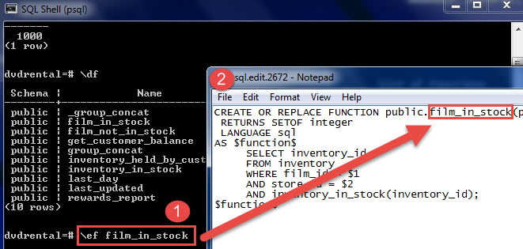

<!-- TOC -->
* [psql Commands](#psql-commands)
  * [Edit command in your editor](#edit-command-in-your-editor)
  * [Switch output options](#switch-output-options)
  * [Connect to PostgreSQL database](#connect-to-postgresql-database)
* [Cambiar a la cuenta de postgres](#cambiar-a-la-cuenta-de-postgres)
* [Acceder a una línea de comandos de Postgres sin cambiar de cuenta](#acceder-a-una-línea-de-comandos-de-postgres-sin-cambiar-de-cuenta)
* [Hacer un backup comprimido](#hacer-un-backup-comprimido)
  * [Windows:](#windows)
  * [Linux:](#linux)
* [Restaurar de un backup comprimido](#restaurar-de-un-backup-comprimido)
<!-- TOC -->

# psql Commands

https://www.postgresqltutorial.com/postgresql-administration/psql-commands/

* Show databases: `\l`
* Connect to a database: `\c <database> username`  If you omit the `user` parameter, the current `user` is assumed
* List users and their roles: `\du`
* Show tables: `\dt`
* Show columns of a table: `\d <table> or \d+ <table>`
* List available schema `\dn`
* List available functions `\df`
* List available views `\dv`
* Execute the previous command `\g`
* Command history `\s`. If you want to save the command history to a file `\s filename`
* Execute psql commands from a file `\i filename`
* Get help on psql commands `\?`. For example, if you want to know detailed information on the **ALTER TABLE** statement `\h ALTER TABLE`
* Turn on query execution time `\timing`. You use the same command `\timing` to turn it off.
* Quit: `\q`

## Edit command in your editor

It is very handy if you can type the command in your favorite editor. To do this in psql, you `\e` command. After issuing the command, psql will open
the text editor defined by your **EDITOR** environment variable and place the most recent command that you entered in psql into the editor.

After you type the command in the editor, save it, and close the editor, psql will execute the command and return the result.

It is more useful when you edit a function in the editor.

`\ef [function name]`



## Switch output options

psql supports some types of output format and allows you to customize how the output is formatted on the fly.

* \a command switches from aligned to non-aligned column output.
* \H command formats the output to HTML format.

## Connect to PostgreSQL database

`psql -d database -U  user -W`

If you want to connect to a database that resides on another host, you add the -h option as follows:

`psql -h host -d database -U user -W`

In case you want to use SSL mode for the connection, just specify it as shown in the following command:

`psql -U user -h host "dbname=db sslmode=require"`

# Cambiar a la cuenta de postgres

`sudo -i -u postgres`

# Acceder a una línea de comandos de Postgres sin cambiar de cuenta

`sudo -u postgres psql`

# Hacer un backup comprimido

## Windows:

`pg_dump --verbose --dbname=bps --username=postgres | gzip > bps-dump.sql.gz`

## Linux:

```
(pg_dump --verbose --dbname=grp9_test.2024-09-04-test --username=odoo | gzip -9) > grp9_test.2024-09-04-test-`date +%Y-%m-%d-%H-%M-%S`.sql.gz
```

**Nota:** Debe de estar instalado el gzip, ya sea instalando git el cual lo hace automáticamente u otra via.

**Usar sin contraseña:**

1. Create a password file (e.g., **~/.pgpass**) with the following content:
2. 127.0.0.1:5432:grp_test_2023_09_01:odoo:odoo
3. chmod 600 ~/.pgpass

# Restaurar de un backup comprimido

```
zcat grp_test.2023-09-01-test.sql.gz | psql --username=odoo --host="127.0.0.1" --port=5432 
--dbname=grp_test_2023_09_01 --no-password
```

